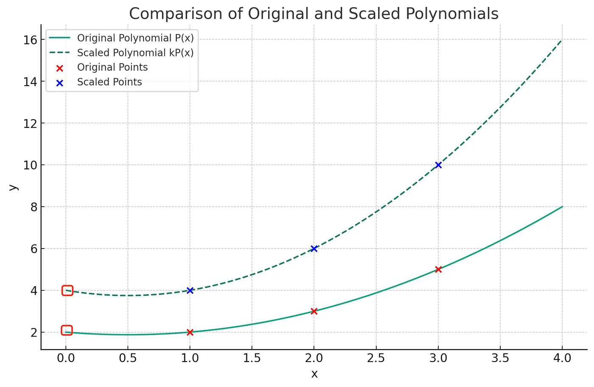
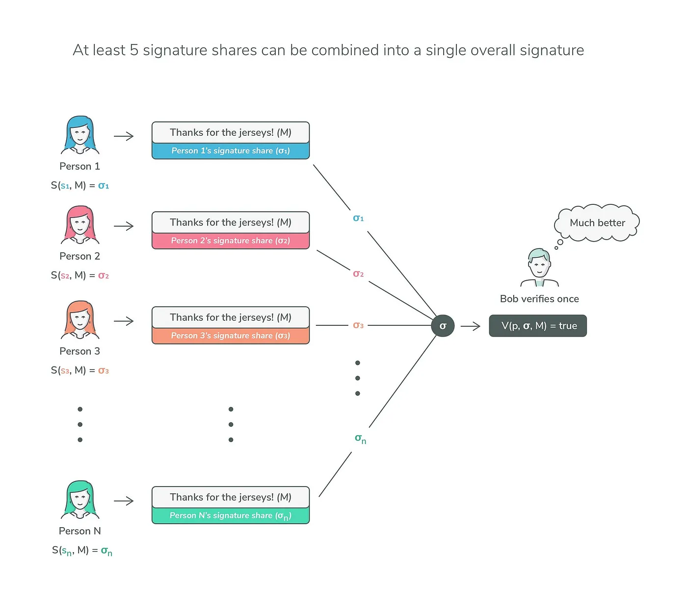
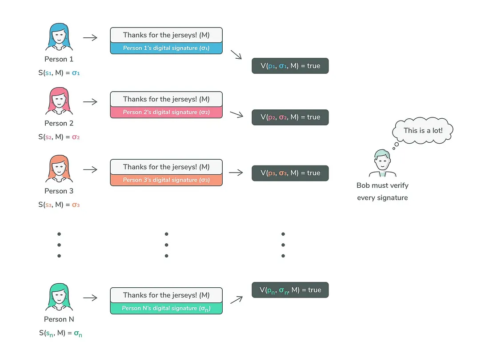

# 阈值签名

> 私钥永远不存在

`(t, n)` 门限签名方案 (TSS) 是一种密码协议，允许一组 n 个参与者共同签署文档或交易，其中 `t + 1` 个或更多参与者的任何子集都可以产生有效签名，但 `t` 的子集 或更少的人不能。 该方案旨在通过确保没有任何一方可以单方面生成签名来增强分布式系统的安全性和信任，从而防止未经授权的操作。 TSS 通过将控制权分散给多方（密钥从不存在）来增强加密密钥的安全性。

## 初步：多项式插值

`(t-1)` 次多项式由 `t` 个点唯一确定。 例如，两个点定义一条直线，三个点定义一条抛物线，等等。

如果所有点都按常数因子缩放，则插值多项式也按相同因子缩放。 它在 `x = 0` 处的 `y` 截距也是如此。



在上面的示例中，您有一个拟合点 `{(1,2), (2,3), (3,5)}` 的 2 次多项式 P(x)，并且您将 y 值缩放 2，
您实际上 将 `P(x)` 按 `2` 缩放以获得 `{(1,4), (2,6), (3,10)}` 的插值多项式。 
它的 `y` 轴截距也按 `2` 缩放，从 `2` 变为 `4`。

我们将在整篇文章中多次使用这一观察结果。

## 门限签名方案

想象一个场景，其中有一组 `n` 个参与者，标记为 `P₁` 到 `Pₙ` 在此设置中，`(t, n)` 阈值签名方案 (TSS) 
授予 `t + 1` 个成员的任意组合协作生成签名的能力。 然而，任何小于或等于t个成员的群体都缺乏这种能力。

TSS 包括三个阶段:

### 1. 密钥生成

使用分布式密钥生成 (DKG) 协议，如我们之前的文章[分布式密钥生成](../Distributed%20Key%20Generation/README.md)中所述。 共享的秘密是私钥 `sk`，任何一方都不知道。


假设 DKG 由参与者运行，表示为 `P₁` 到 `Pₙ`，并导致每个用户 `Pᵢ` 收到单独的秘密共享 `skᵢ` 以及用于验证目的的共享公钥 `pk`。
`skᵢ` 代表整个秘密 `sk` 的 `(t, n)` Shamir 秘密份额。 
请注意，此密钥生成是 TSS 的一次性初始设置阶段，这意味着一旦建立，这些私钥共享可重复用于多个操作。

共享公钥 `pk` 是所有份额承诺 `(skᵢG)` 插值的 `0` 截距，在可验证秘密共享 (VSS) 阶段广播。 要了解原因，请注意:

```
pk = skG
```

`G` 位于生成点且为常数。 `sk` 是所有 `skᵢ` 的 `0` 截距，因此 `pk` 是所有 `skᵢG` 的 `0` 截距。

### 2. 签名生成

签名生成分两步进行：

部分签名生成：每个参与者使用他在消息 `M` 上的份额 `skᵢ` 生成部分签名 `σᵢ： σᵢ = S(skᵢ, M)`，S 是签名函数。

部分签名聚合：聚合这些部分签名将产生最终签名 `σ`。 最关键的是，这个过程保证了私钥永远不会出现，从而不会发生泄密的情况。



### 3. 签名验证

门限签名方案的验证与其非门限签名方案的验证相同。 任何有权访问公钥和消息的人都可以验证签名的有效性。

## BLS 阈值签名

有多种签名方案可以扩展到阈值版本，包括 [ECDSA](https://www.cryptologie.net/article/605/whats-out-there-for-ecdsa-threshold-signatures/)、Schnorr 和 BLS。 为了便于说明，我们选择BLS作为例子。

### 密钥生成

在阈值密钥生成结束时，每个用户 `Pᵢ` 获得密钥共享 `skᵢ` 和用于验证的公共公钥 `pk`。

### 部分签名生成

此步骤与非阈值BLS相同。见 [比特币上的 BLS 签名](../BLS%20Signatures%20on%20Bitcoin/BLS%20Signatures%20on%20Bitcoin.md)

`Pᵢ` 生成签名共享如下。

```
σᵢ = skᵢH(m)
```

`m` 是消息，`H` 是加密哈希函数。

事实证明 `σ` 是所有 `σᵢ` 的拉格朗日插值的 `y` 截距。

这是因为 `σᵢ` 是 `skᵢ` 的常数因子，即 `H(m)`，由所有参与者共享。 
由于 `sk` 是 DKG 中所有 `skᵢ` 的拉格朗日插值的 `y` 截距，因此 `σ` 是所有 `σᵢ` 的插值。

### 验证

聚合签名 `σ` 现在是聚合公钥 `pk` 的 `m` 的有效签名。 签名验证与无阈值版本相同。 验证者检查以下等式：

```
e(H(m), pk) ?= e(σ, G)
```

`pk` 是聚合公钥，`G` 是生成点。


## 比较
门限签名是 DKG 和多重签名 (MultiSig) 技术集成的产物，融合了各自的优越特性。 这种融合产生了强大的加密解决方案，囊括了其前身的优点。

### TSS vs. Multisig

与多重签名方法相比，门限签名方案（TSS）被认为可以生成更紧凑的签名，同时增强隐私保护。 
此外，TSS 本质上将多重签名功能扩展到区块链技术，否则这些技术不直接支持这些功能，特别是在需要效率和自由裁量权的情况下。 
至关重要的是，TSS 架构避免将私钥存储在服务器上，从而加强风险管理并促进参与者之间的责任划分。
这些突出的优势使 TSS 成为开发实时运行且不损害私钥机密性的安全热钱包的最佳解决方案。



<center>多重签名</center>

### TSS vs. DKG

在 DKG 中，如果法定人数的参与者与其份额进行协作，则可以构建秘密。 在签名的上下文中，秘密是私钥。 可以先创建并用于签名。 然而，私钥的存在，即使是短暂的，也会造成单点故障，使其容易受到攻击。 
在 TSS 中，私钥永远不存在，并且在签名过程中的任何时刻都没有人看到明文形式的私钥，从而使其免受此类攻击。

## 实现

我们在比特币上实施了 `(3, 5)` 阈值签名方案。 我们选择 TSS 的 ECDSA 版本，因为比特币本身支持 ECDSA。
它基于库 [tss-lib](https://github.com/bnb-chain/tss-lib)。


```go
const (
	testParticipants = 5
	testThreshold    = 3
)

func setUp(level string) {
	if err := log.SetLogLevel("tss-lib", level); err != nil {
		panic(err)
	}
}


func main() {
	setUp("info")
	threshold := testThreshold

	// PHASE: load keygen fixtures
	keys, signPIDs, err := keygen.LoadKeygenTestFixturesRandomSet(testThreshold+1, testParticipants)

    pubKeyHex := publicKeyToHexCompressed(keys[0].ECDSAPub.ToECDSAPubKey())
    addrHex, _ := compressedPubKeyToAddress(pubKeyHex)
    fmt.Printf("Pub Key (x, y): %s %s\n", keys[0].ECDSAPub.X(), keys[0].ECDSAPub.Y())
    fmt.Printf("Pub Key (hex, compressed): %s\n", pubKeyHex)
    fmt.Printf("Address (hex): %s\n", addrHex)

	// PHASE: signing
	// use a shuffled selection of the list of parties for this test
	p2pCtx := tss.NewPeerContext(signPIDs)
	parties := make([]*LocalParty, 0, len(signPIDs))

	errCh := make(chan *tss.Error, len(signPIDs))
	outCh := make(chan tss.Message, len(signPIDs))
	endCh := make(chan *common.SignatureData, len(signPIDs))

	updater := test.SharedPartyUpdater
    msgData, _ := hex.DecodeString("f7ab4253b131f70e698051aa621d1ae09665500ef4580d0d2decbc0d4b863671") // TODO: Put tx sighash here
	// init the parties
	for i := 0; i < len(signPIDs); i++ {
		params := tss.NewParameters(tss.S256(), p2pCtx, signPIDs[i], len(signPIDs), threshold)
		P := NewLocalParty(new(big.Int).SetBytes(msgData), params, keys[i], outCh, endCh, len(msgData)).(*LocalParty)
		parties = append(parties, P)
		go func(P *LocalParty) {
			if err := P.Start(); err != nil {
				errCh <- err
			}
		}(P)
	}

	var ended int32
signing:
	for {
		fmt.Printf("ACTIVE GOROUTINES: %d\n", runtime.NumGoroutine())
		select {
		case err := <-errCh:
			common.Logger.Errorf("Error: %s", err)
			break signing

		case msg := <-outCh:
			dest := msg.GetTo()
			if dest == nil {
				for _, P := range parties {
					if P.PartyID().Index == msg.GetFrom().Index {
						continue
					}
					go updater(P, msg, errCh)
				}
			} else {
				if dest[0].Index == msg.GetFrom().Index {
					fmt.Printf("party %d tried to send a message to itself (%d)", dest[0].Index, msg.GetFrom().Index)
          exit(1)
				}
				go updater(parties[dest[0].Index], msg, errCh)
			}

		case <-endCh:
			atomic.AddInt32(&ended, 1)
			if atomic.LoadInt32(&ended) == int32(len(signPIDs)) {
				fmt.Printf("Done. Received signature data from %d participants", ended)
				R := parties[0].temp.bigR
                //r := parties[0].temp.rx

				modN := common.ModInt(tss.S256().Params().N)

				// BEGIN check s correctness
				sumS := big.NewInt(0)
				for _, p := range parties {
					sumS = modN.Add(sumS, p.temp.si)
				}
				// END check s correctness

        fmt.Printf("Sig (r, s): %s %s\n", R.X(), sumS)

				// BEGIN ECDSA verify
				pkX, pkY := keys[0].ECDSAPub.X(), keys[0].ECDSAPub.Y()
				pk := ecdsa.PublicKey{
					Curve: tss.EC(),
					X:     pkX,
					Y:     pkY,
				}
				ok := ecdsa.Verify(&pk, msgData, R.X(), sumS)
				fmt.Println(ok)
				// END ECDSA verify

				break signing
			}
		}
	}
}
```

[完整代码](https://gist.github.com/msinkec/27f8235dd3ad94b64829def5408acec5)

单次运行会产生以下交易：

* 部署交易ID:
  [3c0d8b44f8740a0c45162fa6bb6835808b9b04a884853fcb597af1a0812d6345](https://test.whatsonchain.com/tx/3c0d8b44f8740a0c45162fa6bb6835808b9b04a884853fcb597af1a0812d6345)

* 支出交易 ID：
  [cfc1704361367d902da142c3307c4d0ef9cfe6c6e5d882af258c3a1964ebe9b5](https://test.whatsonchain.com/tx/cfc1704361367d902da142c3307c4d0ef9cfe6c6e5d882af258c3a1964ebe9b5)

地址和签名看起来与正常生成的相同，未使用 TSS。