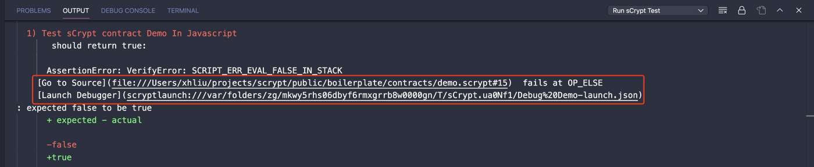

# 回到错误发生前

> 直接从失败的测试log启动调试器

sCrypt IDE 允许您启动一个调试器，它会自动在 sCrypt 测试失败的地方停止。这将极大地帮助开发人员定位合约的错误。

以前，当使用 sCrypt 测试框架测试失败时，错误消息只显示在 JavaScript/TypeScript 代码中失败的地方。如果用户需要找出 sCrypt 代码中失败的地方，他必须[打印出调试参数](https://github.com/sCrypt-Inc/boilerplate/blob/4a7afa24e52fee738456a4f23d7e1112fc7794b3/tests/js/p2pkh.scrypttest.js#L29-L35)，将它们复制并粘贴到 *launch.json* 中，这是一个费力且容易出错的过程。

直接从失败的 sCrypt 测试启动调试器

在最新的 IDE 中，当测试失败时，错误消息中会多出两行。

- **Go to Source:** 它显示了 sCrypt 代码中哪一行失败，以及最后执行的操作码。右键单击该链接将直接跳转到出错的那一行源代码。

- **Launch Debugger:** 右键单击链接将根据测试中的参数直接启动调试器会话。调试器将在错误即将发生之前暂停，以便检查导致失败的原因。

输出中的调试信息

