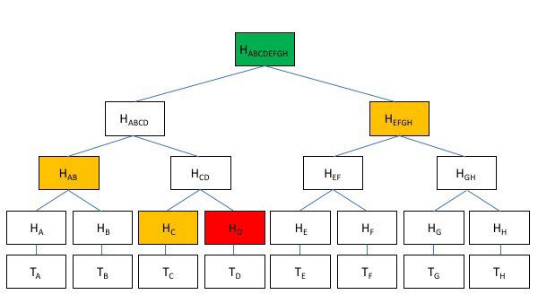
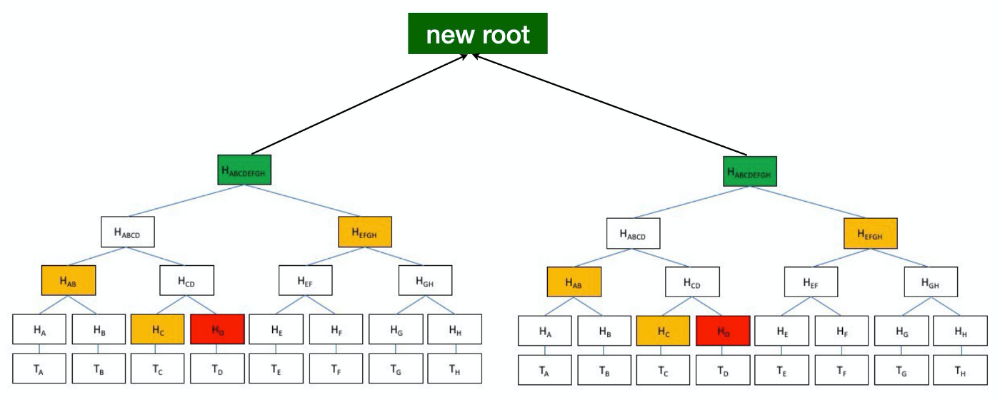

# 树签名 
> 高效且私密的多重签名

我们使用称为树签名(Tree Signatures)的技术提出了一种具有增强隐私的多重签名的有效实现。

与原始树签名¹相反，我们的实现不需要对比特币协议进行任何更改。

## 树签名 

在标准的 `M-of-N` 多重签名中，需要 `M` 个签名来转移资金。所有 `N` 个公钥都必须在区块链上公开。当 `N` 很大时，这会迅速增加脚本大小，例如，在 `1-of-100` 的多重签名中。



[Merkle 树和 Merkle 路径](https://www.tokens24.com/cryptopedia/basics/what-is-a-merkle-tree)


为了解决这个问题，树签名将密钥组织在 Merkle 树中。每个叶子代表 `N` 中 `M` 个键的特定组合。总共有 `C(M, N)²` 个叶子。在 `M` 为 `1` 的情况下，有 `N` 个叶子，每个叶子只是一个唯一的键。

与标准多重签名相比，树签名带来了几个显着的好处，尤其是当 `M-of-N` 组合的数量很大时。

* **可扩展**：脚本大小是以 `log(C(M, N))` 的复杂度扩展，因为只需要选择的分支及其 merkle 路径，而不是所有公钥。
* **隐私性**：只有签名时使用的公钥在链上公开，其他的都是隐藏的。

`M = 3` 时的示例实现如下所示。


```js
contract TreeSig {
    static const int DEPTH = 4;
    // M out of N multisig
    static const int M = 3;
    
    const Sha256 merkleRoot;

    public function main(PubKey[M] pubKeys, Sig[M] sigs, MerklePath merklePath) {
        // validate public keys are from the merkle tree
        require(calMerkleRoot(pubKeys2Leaf(pubKeys), merklePath) == this.merkleRoot);

        // check if all M signatures are valid
        bool allMatch = true;
        loop (M) : i {
            allMatch = allMatch && checkSig(sigs[i], pubKeys[i]);
        }
        require(allMatch);
    }

    // map public keys to a leaf
    static function pubKeys2Leaf(PubKey[M] pubKeys) : bytes {
        bytes leaf = b'';

        loop (M) : i {
            leaf += pubKeys[i];
        }
        return leaf;
    }

    static function calMerkleRoot(bytes leaf, MerklePath merklePath) : Sha256 {
        Sha256 root = sha256(leaf);

        loop (DEPTH) : i {
            Sibling s = merklePath[i];
            root = s.left ? sha256(s.hash + root) : sha256(root + s.hash);
        }

        return root;
    }
}
```

[树签名合约](https://github.com/sCrypt-Inc/boilerplate/blob/master/contracts/treeSig.scrypt)

## 高级用法

### M-of-N 的子集


扩展标准树签名的一种直接方法是选择任意严格的 `M-of-N` 键组合子集作为叶子，而不是所有 `M-of-N` 组合。例如，在 `2-of-3` 方案中，包括 `(key1, key2)` 和 `(key2, key3)`，但不包括 `(key1, key3)`。这提供了比标准多重签名更大的灵活性。

### 可组合性

我们甚至可以将多个签名树合并为一棵树，它可以通过原始子树中任何叶子中的密钥的签名来解锁。



<center>合并两个树签名</center>

----------------

[1] Pieter Wuille, [树签名(Tree Signatures)](https://blockstream.com/2015/08/24/en-treesignatures/), 2015

[2] C(M, N) 代表 [N 个中选择 M 个](https://en.wikipedia.org/wiki/Combination)。