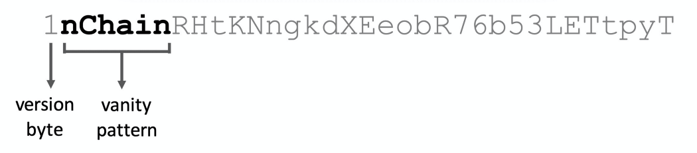

# 去信任外包荣耀地址生成

> 无需零知识证明



<center>一个荣耀地址</center>

之前，我们展示了一种使用 [零知识密钥声明证明](https://xiaohuiliu.medium.com/zero-knowledge-key-statement-proof-188ba2dc2c30) 购买比特币荣耀地址的新颖且私密的方式。在实践中，它有一个缺点：买方在步骤 `7` 中验证了证明后，他可以中止交换协议，卖方浪费资源寻找答案却没有得到报酬。

为了克服这个缺点，我们使用智能合约完全在链上进行交换。只有提供了私钥（例如派生/组合公钥/地址）满足荣耀地址模式，它才会支付。完整代码如下所示。

```javascript
import "ec.scrypt";

// outsource a vanity address generation
contract VanityAddr {
    // buyer's public key
    PubKey pubKey;
    // vanity address pattern such as vanity prefix "nChain"
    bytes pattern;

    // x is the secret seller finds
    // all other parameters are auxiliaries of it
    public function offerVanityAddr(PrivKey x, PubKey X, PubKey derivedPubKey, int lambda, SigHashPreimage txPreimage) {
        // verify = X = x * G?
        require(Tx.checkPreimageAdvanced(txPreimage, x, X, Tx.invK, Tx.r, Tx.rBigEndian, SigHashType(SigHash.ALL | SigHash.FORKID)));

        // verify P' = P + X
        require(EC.isPubKeySum(this.pubKey, X, lambda, derivedPubKey));

        // meet requirement
        require(matchPattern(derivedPubKey, this.pattern));
    }

    // check if public key's address matches the given pattern
    static function matchPattern(PubKey pubKey, bytes pattern) : bool {
        // convert public key to address
        bytes addr = ripemd160(sha256(pubKey));

        // prefix match
        int l = len(pattern);
        return addr[:l] == pattern;
    }
}
```

<center><a href="https://github.com/sCrypt-Inc/boilerplate/blob/master/contracts/vanityAddr.scrypt">VanityAddr 源代码</a></center>


为了有效地计算点加法（第 `16` 行）和乘法（第 `13` 行），我们利用了与[以前相同的技术](https://xiaohuiliu.medium.com/ecdsa-based-oracles-on-bitcoin-e69d15afe6c5)。
在我们获得组合的公钥后，我们在第 `19` 行验证其对应的地址是否符合预定义的虚荣模式。

## 	延展

我们只展示了如何验证派生地址是否具有特定前缀。但是可以直接扩展它以使地址或公钥满足任何任意要求。