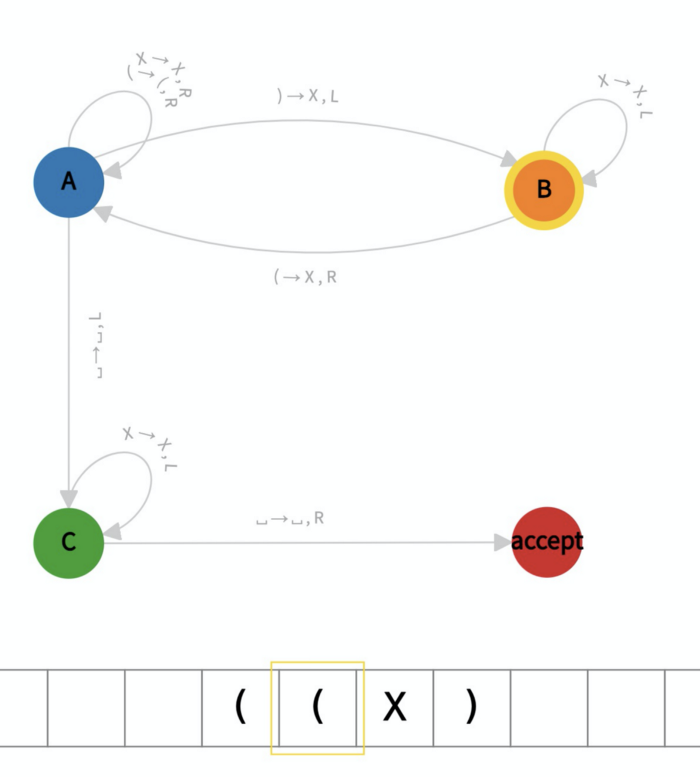

# 比特币上的图灵机

> 比特币图灵完备证明

我们通过实践证明任何图灵机都可以在比特币上进行模拟，从而证明它是图灵完备的¹。我们已经实现了一个识别平衡括号的图灵机，并将其部署在比特币区块链上。任何其他的图灵机都可以用同样的方式模拟。

## 图灵机简介

图灵机由以下组件（简化）组成：

1. 当前状态，在一组有限的状态中（一个状态标记为初始状态，一些状态标记为接受状态）

2. 带有存储单元和可以在磁带上移动的读/写头的磁带

3. 一个所谓的过渡函数，它告诉机器该做什么和什么时候做。

在下面的示例中，我们展示了用于[检查平衡括号](https://math.stackexchange.com/questions/503853/how-do-you-argue-or-prove-that-a-certain-turing-machine-accepts-a-language)的图灵机。它的初始状态是 A 并且它包含一个接受状态。转换函数表示，例如，如果图灵机处于状态 A 并且其头部读取符号“（”，则它应该在该单元格中写入“X”并向左移动，转换到状态 B。


<center>一个用于检查平衡括号的图灵机</center>

## 邱奇-图灵论题

[邱奇-图灵](https://simple.wikipedia.org/wiki/Church-Turing_thesis) 论题指出，图灵机可以计算任何可以计算的东西。它是计算的定义，也是计算机理论的基本工具。


## 在比特币上模拟图灵机


我们将展示一种在比特币上模拟图灵机的通用方法。我们拍摄正在运行的图灵机的快照：磁头位置、当前状态和磁带。快照存储在[有状态的比特币智能合约](https://blog.csdn.net/freedomhero/article/details/107307306)中。更具体地说，它们是比特币交易的输出。运行图灵机的每一步都由比特币交易触发。图灵机可以继续运行，除非它进入可接受的状态。


<center>模拟图灵机 (TM)</center>


## 实现

为了证明在比特币上模拟图灵机的可行性，我们已经实现了前面提到的图灵机来检查平衡括号，如下所示。

```javascript

contract TuringMachine {
    // states
    static const State STATE_A = b'00';     // initial state
    static const State STATE_B = b'01';
    static const State STATE_C = b'02';
    static const State STATE_ACCEPT = b'03';
    
    // symbols
    static const Symbol BLANK = b'00';
    static const Symbol OPEN  = b'01';
    static const Symbol CLOSE = b'02';
    static const Symbol X     = b'03';

    static const bool LEFT = true;
    static const bool RIGHT = false;
    // number of rules in the transition function
    static const int N = 8;
    // transition function table
    static const TransitionFuncEntry[N] transitionFuncTable = [
        {{STATE_A, OPEN},   {STATE_A, OPEN, RIGHT}},
        {{STATE_A, X},      {STATE_A, X, RIGHT}},
        {{STATE_A, CLOSE},  {STATE_B, X, LEFT}},
        {{STATE_A, BLANK},  {STATE_C, BLANK, LEFT}},
        
        {{STATE_B, OPEN},   {STATE_A, X, RIGHT}},
        {{STATE_B, X},      {STATE_B, X, LEFT}},

        {{STATE_C, X},      {STATE_C, X, LEFT}},
        {{STATE_C, BLANK},  {STATE_ACCEPT, BLANK, RIGHT}}
    ];

    public function transit(SigHashPreimage txPreimage, int amount) {
        // read/deserialize contract state
        // ...
        
        // transition
        Symbol head = Util.getElemAt(s.tape, s.headPos);
        // look up in transition table
        bool found = false;
        loop (N) : i {
            if (!found) {
                auto entry = transitionFuncTable[i];
                if (entry.input == {s.curState, head}) {
                    auto output = entry.output;
                    // update state
                    s.curState = output.newState;
                    // write tape head
                    s.tape = Util.setElemAt(s.tape, s.headPos, output.write);
                    // move head
                    s.headPos += output.moveLeft ? -1 : 1;
                    // extend tape if out of bound
                    if (s.headPos < 0) {
                        // add 1 blank cell to the left
                        s.tape = BLANK + s.tape;
                        s.headPos = 0;
                    } else if (s.headPos >= len(s.tape))  {
                        // add 1 blank cell to the right
                        s.tape = s.tape + BLANK;
                    }

                    if (s.curState == STATE_ACCEPT) {
                        // accept
                        exit(true);
                    }

                    found = true;
                }
            }
        }
        // reject if no transition rule found
        require(found);

        // otherwise machine goes to the next step

        // write/serialize contract state
        // ...
    }
}
 
```

<center> <a href="https://github.com/sCrypt-Inc/boilerplate/blob/master/contracts/turingMachine.scrypt">图灵机合约</a>检查平衡括号 </center>

每次在事务中调用公共函数transit() 时，机器前进一步。

- 第 3-6 行：定义状态，包括初始状态和接受状态
- L9-12：定义所有符号
- L19-30：将转换函数定义为表格
- L37：从头部读取符号
- L40-43：使用当前状态和磁头符号，我们在转移函数表中查找新状态（L46），写入磁带（L48），移动磁头（L50）。
- L51-59：最初磁带只包含输入字符串，例如“(())()()”。如果任何时候磁带用完，无论是在左侧 (L52) 还是右侧 (L56)，都会添加一个空白单元格。这确保磁带可以任意长并且是无界的（但不是无限²）。

## 部署

我们已经将上面的图灵机部署到比特币，并在输入字符串“(())()()”上运行它。完整的执行如下所示。


<center>接受 (())()() 的图灵机</center>

这是第 0 步的图灵机：


你可以看到图灵机的快照被编码在这个[交易](https://whatsonchain.com/tx/a0bc71204f8431c6c5df7a12fc3cb2638e987a0c308a60fcd120e1e148094dc9)中。


同样，这是第 3 步：



它的编码如下：


## 图灵完备证明

通过简单地更改状态、符号和转换函数，可以很简单地将上述图灵机合约改编为实现任何其他图灵机。因此，任何图灵机都可以在比特币上进行模拟，最终证明比特币根据定义是[图灵完备](https://en.wikipedia.org/wiki/Turing_completeness)的。 QED。

> 在可计算性理论中，如果一个数据操作规则系统可用于模拟任何图灵机，则称其为图灵完备的

## 致谢

感谢 Pasquale Valentin 帮助在比特币上部署合约。

[1] 我们通过在比特币上实施图灵竞争系统（例如康威的[生命游戏](https://blog.csdn.net/freedomhero/article/details/111152834)和[规则 110](https://xiaohuiliu.medium.com/turing-complete-rule-110-on-bitcoin-df014288a05)），展示了比特币是图灵完备的。

[2] [无限与无界](https://craigwright.net/blog/math/infinite-and-unbounded/) 作者：Craig Wright | 2021 年 9 月 14 日
