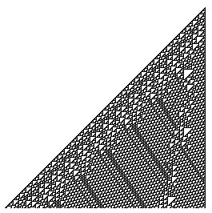
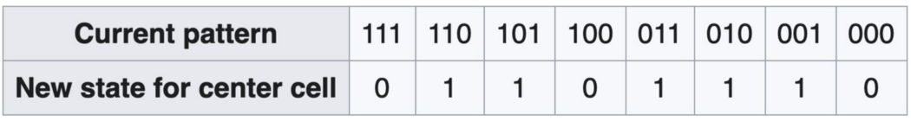
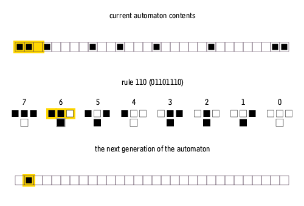

# 比特币上的图灵完备的 **规则 110**

我们已经在比特币上实现了 [规则 110](https://en.wikipedia.org/wiki/Rule_110)。类似于二维元胞自动机 (CA) [康威生命游戏](https://blog.csdn.net/freedomhero/article/details/111152834?spm=1001.2014.3001.5501)，一维 CA **规则 110** 也是图灵完备的。通过推论，我们再次证明了比特币是图灵完备的。

## Rule 110



Rule 110 元胞自动机是一维基本 CA，其中 0 和 1 的线性模式根据一组简单的规则演化。模式中的一个点在新一代中是 0 还是 1 取决于它的当前值和它的两个邻居的值。规则 110 具有以下规则集：



“规则110”的名称是基于该规则可以概括为二进制序列01101110，对应十进制值是110。




## 图灵完备

尽管它很简单，但规则 110 是图灵完备的，正如在[基本元胞自动机中的普遍性](http://wpmedia.wolfram.com/uploads/sites/13/2018/02/15-1-1.pdf)（Cook 2004）中所证明的那样。这意味着，原则上，它可以模拟任何计算或计算机程序。规则 110 可以说是最简单的已知图灵完备系统。

## 实现

类似实现[康威生命游戏](https://blog.csdn.net/freedomhero/article/details/111152834)，我们已经实施了规则 110。

```javascript
contract rule110 {
    static const int N = 5; //size of board
    static const int N2 = 3; //size of board
    static bytes LIVE = b'01';
    static bytes DEAD = b'00';

    @state
    bytes board;
    
    public function play(int amount, SigHashPreimage txPreimage) {
        this.board = this.computeNewBoard(this.board);
        require(this.propagateState(txPreimage, amount));
    }

    function computeNewBoard(bytes board) : bytes {
        bytes res = b'';
        res += DEAD;
        loop (N2) : i {
            res += this.newState(board[i : i + 3]);
        }
        res += DEAD;
        return res;
    }
    
    function newState(bytes arg) : bytes {
        /*
          Current pattern	        111	110	101	100	011	010	001	000
          New state for center cell	 0	 1	 1	0	 1	 1	 1	 0
        */
        bytes a = arg[0 : 1];
        bytes b = arg[1 : 2];
        bytes c = arg[2 : 3];
        bytes res = LIVE;
        if (a == LIVE && b == LIVE && c == LIVE) {
            res = DEAD;
        }
        if (a == LIVE && b == DEAD && c == DEAD) {
            res = DEAD;
        }
        if (a == DEAD && b == DEAD && c == DEAD) {
            res = DEAD;
        }
        return res;
    }

    function propagateState(SigHashPreimage txPreimage, int value) : bool {
        SigHashType sigHashType = SigHash.ANYONECANPAY | SigHash.SINGLE | SigHash.FORKID;
        // this ensures the preimage is for the current tx
        require(Tx.checkPreimageSigHashType(txPreimage, sigHashType));
        bytes outputScript = this.getStateScript();
        bytes output = Utils.buildOutput(outputScript, value);
        return hash256(output) == SigHash.hashOutputs(txPreimage);
    }
}

```

[规则 110 合约](https://github.com/sCrypt-Inc/boilerplate/blob/master/contracts/rule110.scrypt)
