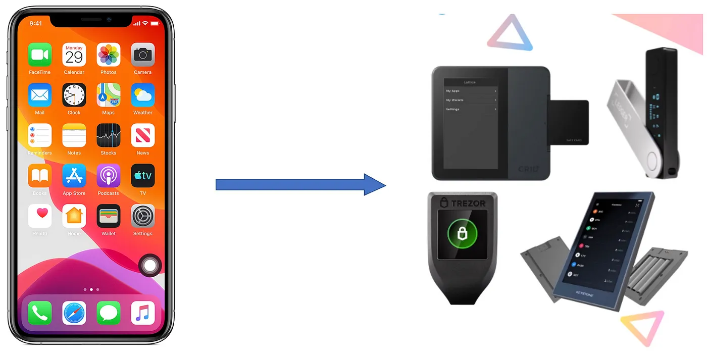
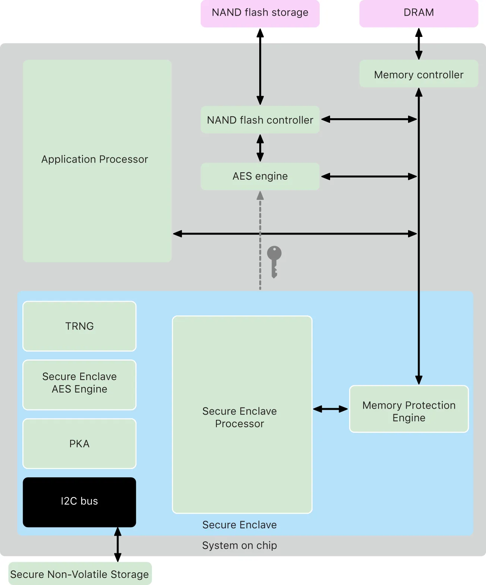
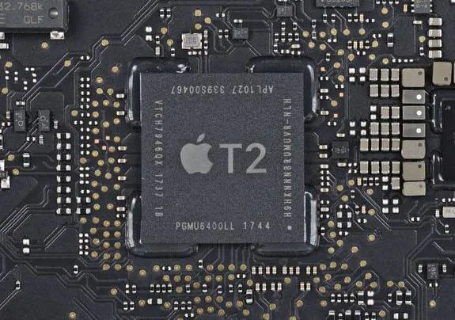

# 使用 Secure Enclaves 将每部智能手机变成BSV硬件钱包

我们使用 iOS 和 Android 设备的安全区域来存储比特币私钥。 密钥永远不会离开飞地，提供与硬件钱包相同的安全性。 这实质上将数十亿智能手机变成了安全的比特币硬件钱包。 用户可以使用 FaceID 和 TouchID 授权比特币交易。



<center>将 iPhone 变成硬件钱包</center>

## 安全飞地

[安全飞地 (Secure Enclave)](https://developer.apple.com/documentation/security/certificate_key_and_trust_services/keys/protecting_keys_with_the_secure_enclave) 是 Android、iPhone、iPad 和 Mac 中的一种特殊芯片，可保护您的生物识别数据，如 FaceID 和 TouchID。 安全飞地的主要特点是在其上生成的私钥不能离开芯片，提供最大的安全性，就像在 Ledger 和 Trezor 等硬件钱包中一样。



<center><a href="https://support.apple.com/en-gb/guide/security/sec59b0b31ff/web">安全飞地</a></center>



<center>英特尔 Mac 中的 Apple T2 安全飞地芯片</center>

其中的私钥可用于安全地签署消息。 消息被发送到 Secure Enclave 中，经过签名，然后返回签名。 签名期间的私钥驻留在芯片中，不存储在内存中，因此无法通过软件访问。 可以使用 FaceID 和 TouchID 等生物识别身份验证来授予签署交易的权限。

## 椭圆曲线 secp256r1

安全飞地支持单椭圆曲线 [secp256r1](https://developer.apple.com/documentation/cryptokit/secureenclave/p256)，也称为 [prime256 和 P-256](https://crypto.stackexchange.com/questions/33052/is-there-any-difference-between-nist-and-secp-curves-in-terms-of-their-algorithm)。 它不同于用于比特币和以太坊等流行区块链的椭圆曲线 [secp256k1](https://wiki.bitcoinsv.io/index.php/Secp256k1)。

所有椭圆曲线的形式都是 `y² = x³ + ax + b`。

在 secp256k1 曲线中，我们有:

```
a = 0
b = 7
```

在 secp256r1 曲线中，我们有:


```
a = FFFFFFFF 00000001 00000000 00000000 00000000 FFFFFFFF FFFFFFFF FFFFFFFC
b = 5AC635D8 AA3A93E7 B3EBBD55 769886BC 651D06B0 CC53B0F6 3BCE3C3E 27D2604B
```

由于缺乏对 secp256r1 的原生支持，现在所有的加密货币钱包应用程序都使用软件签名，而不是硬件签名。 软件签名容易受到侧信道攻击，从而泄露有关私钥的信息。

## 在BSV上实现 secp256r1


由于比特币智能合约的表现力和可扩展性，我们可以在合约级别高效地实现 secp256r1，特别是 ECDSA 签名验证。 签名由安全飞地生成，享有最大的安全性。 然后我们在智能合约中验证硬件签名。 请注意，这不需要对基础层进行任何重大更改，即使它使用了不同的曲线。

我们修改了之前发布的[ECDSA签名验证](https://blog.csdn.net/freedomhero/article/details/125478566)的实现，从曲线secp256k1切换到secp256r1。 它基本上实现了标准的 ECDSA 验证算法。

```ts
static verifySig(data: ByteString, sig: Signature, pubKey: Point): boolean {
    // Hash message.
    const hash = hash256(data)

    const hashInt = unpack(reverseBytes(hash, 32) + toByteString('00'))

    const sInv = SECP256R1.modInverseBranchlessN(sig.s)
    const u1 = SECP256R1.modReduce(hashInt * sInv, SECP256R1.n)
    const u2 = SECP256R1.modReduce(sig.r * sInv, SECP256R1.n)

    const U1 = SECP256R1.mulGeneratorByScalar(u1)
    const U2 = SECP256R1.mulByScalar(pubKey, u2)
    const X = SECP256R1.addPoints(U1, U2)

    return sig.r == X.x
}
```

<center><a href="https://github.com/sCrypt-Inc/scrypt-ts-lib/blob/master/src/ec/secp256r1.ts">secp256r1</a></center>

## 备份

为了尽可能安全，安全飞地不允许导出密钥，因此无法备份密钥（不同于带有助记词的硬件钱包）。 如果智能手机丢失和损坏，则私钥及其控制的资金将丢失。

一种解决方案是创建 1 of 2（或 N）多重签名钱包。 一个密钥可以离线生成并安全地存储在冷钱包中。 第二个密钥在 Secure Enclave 内部生成。 如果手机丢失或损坏，用户可以安全地使用他们的离线备份密钥将资金从钱包中移出。

如果您有兴趣构建首个硬件签名比特币钱包，请[联系我们](support@scrypt.io)。 硬件钱包所属的一些其他类型的硬件安全模块（[HSM](https://en.wikipedia.org/wiki/Hardware_security_module)），如[智能卡](https://www.smartcard-hsm.com/2014/08/22/using-smartcard-hsm-with-ecc-and-opensc.html)也支持椭圆曲线，因此它们也可以充当比特币钱包。