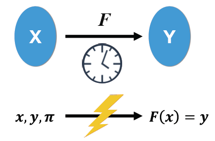
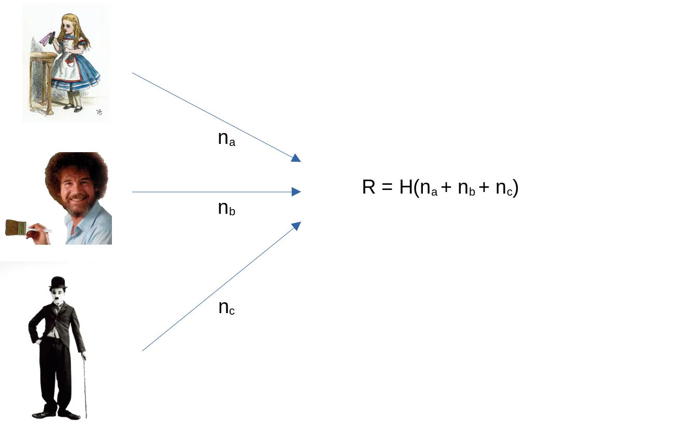
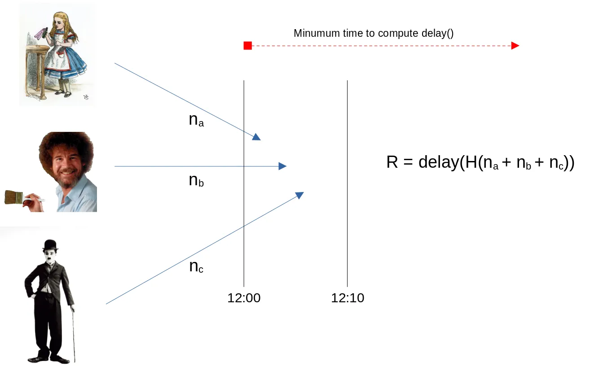

# 比特币上的可验证延迟函数

可验证延迟函数 (VDF) 是一种需要大量 **顺序计算** 来评估但可以快速验证的函数。我们首次在比特币上实现了它。VDF 作为密码学技术可用于构建大量新应用程序，例如公共随机信标、[计算时间戳](https://crypto.iacr.org/2018/slides/28858.pdf)和数据复制证明。



<center> VDF </center>

## 场景

### 链上随机信标

在区块链中很难实现随机性，因为一切都是确定性和公开的。一个经典的例子是两方之间的投注智能合约，如果下一个区块哈希是偶数，则一方获胜，如果是奇数，则另一方获胜。矿工可以通过玩这个合约来作弊，同时忽略任何让他输掉赌注的新区块。

VDF 通过要求随机性不是来自块本身，而是来自它的 VDF 来缓解这个问题。通过将 VDF 调整为需要很长时间来计算，比如 1 小时，矿工就不会因为在下一小时找到的区块中放弃挖矿奖励而作弊，因为它大于赌注金额。

### 彩票

在一个类似的例子中，爱丽丝、鲍勃和查理想玩一轮彩票，这需要他们共同生成一个随机数来决定赢家。在一种简单的方法中，他们每个人都发布一个随机数。一旦所有参与者都这样做了，他们就会计算已发布数字总和的哈希值。



问题是最后一个提交他的号码可以控制结果。例如，如果 Alice 和 Bob 已经提交了他们的值，Charlie 可以尝试使用不同的数字来计算结果，直到他找到一个产生他希望的结果的数字。为了克服这个问题，我们使用 VDF 引入了延迟。假设参与者必须在 `12:00` 到 `12:10` 之间提交他们的号码。在所有数字都提交后（或截止日期已过），它们再次被散列，并在生成的散列上评估 VDF，这需要比 `10` 分钟更长的时间来评估，比如说 `1` 小时。现在查理无法作弊，因为评估结果的时间比提交窗口长。



### 正式定义

有效的 VDF 函数 `f(x)` 必须具有以下属性：

**顺序的**: 任何人都可以在 `t` 个连续步骤中计算 `f(x)`。请注意，计算不能并行化是必要的。这确保了攻击者不能仅仅通过利用更多资源来显着加快计算速度。计算时间仅受单个执行线程的速度限制。
**可高效验证**: 给定输出 `y`，任何观察者都可以在短时间内验证 `y = f(x)`，特别是 `log(t)`。

VDF 是一种可证明减慢速度的方法。他们在输出中引入强制时间延迟，以便恶意行为者无法通过预测未来值来影响它。

### VDF 与工作量证明

VDF 和 PoW 都难以计算，但易于验证。根本区别在于 PoW 可以并行化，而 VDF 不能。


## 实现

由于 VDF 是可有效验证的，我们可以在智能合约中验证它。我们已经为 [Wesolowski](https://eprint.iacr.org/2018/623.pdf) 开发的流行 VDF 实现了一个验证器。

VDF 可以表示为以下函数：

```
y = [x^(2^T)] mod N
```

`x` 是输入值，`T` 是公知的延迟参数，决定了延迟的持续时间，`y` 是输出。

要计算 `x^ 2 ^ T`，我们必须按顺序计算 `x^ 2 ^ i`，其中 `i` 从 `0` 到 `T`。至关重要的是，重复的平方计算不可并行化。

为了使其有效地可验证，以便验证者不需要再次遵循完整的 `T` 步骤，运行以下交互协议。可以使用 Fiat–Shamir 启发式使该协议成为非交互式的。

```
Verifier: 
    Generates random L and sends to prover.

Prover:
    Computes: (q, r) = (2^T)/L
    Then: pi = x ^ q
    Send to prover (y, pi)

Verifier: 
    Computes: r = (2^T) mod L
    Check: y = pi^L * x^r
```

验证器在下面实现。

```js
library VDFVerifierWeslowski {  
    
    static function verify(int g, int pi, int y, int q, int nonce, int delay) : bool {
        bool ret = true;

        ret = ret && nonce <= MAX_NONCE;
        ret = ret && g != 0 && g < RSA_MODULUS;
        ret = ret && pi != 0 && pi < RSA_MODULUS;
        ret = ret && y != 0 && y < RSA_MODULUS;
        ret = ret && q < RSA_MODULUS;

        int l = hashToPrime(g, y, nonce);
        ret = ret && millerRabinPrimalityTest(l);

        int r = modReduce(1 << delay, MAX_NONCE);
        int u1 = modexp(pi, l, RSA_MODULUS);
        int u2 = modexp(g, r, RSA_MODULUS);
        return ret && (mulmod(u1, u2, RSA_MODULUS) == y);
    }
    
    ...
    
}
```

完整的代码和测试可以在 [GitHub](https://github.com/sCrypt-Inc/scrypt-vdf/tree/master/wesolowski) 上找到。

