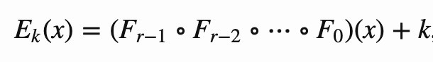
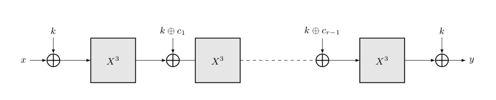

# 比特币中零知识友好的哈希函数 MiMC

[MiMC](https://eprint.iacr.org/2016/492) 是一个“零知识友好”的哈希函数，可以生成有效的零知识证明 (ZKP)。

[之前](https://blog.csdn.net/freedomhero/article/details/125599764)，我们讨论了通过zk-SNARK，零知识证明可以应用于任何数学函数。在内部，需要将函数转换为[电路](https://electriccoin.co/blog/snark-explain5/)，电路中只允许进行加法和乘法运算。虽然理论上所有函数都可以转换，但实际上某些函数的电路更小，并且它们的 ZKP 成本低于其他函数。例如，SHA256 需要大量位操作，因此在电路大小方面是最昂贵的。

MiMC 散列函数专门设计用于通过仅使用加法和乘法来最小化电路大小，从而最小化 ZKP 成本。同时确保反向工程散列的原像的难度不会降低。

哈希函数可以在许多应用中找到，例如承诺方案、签名和默克尔树。当需要高效的 ZKP 时，MiMC 是一个很好的候选哈希函数。

## 算法

为了散列单个数字 `x`，我们计算以下函数：



`r` 是轮数，`Fᵢ` 是第 `i` 轮的轮函数，`k` 是密钥。 `∘` 是函数组合。

`cᵢ` 是圆形常数，`c₀=0`。



<center><a href="https://byt3bit.github.io/primesym/mimc/">r rounds of MiMC: Eₖ(x)</a></center>

## 实现

下面是 MiMC 的一个实现：

```js
static function hash(int x, int k) : int {
    int ret = 0;
    loop (ROUNDS) : i {
        // t = x + ci + k
        int t = (i == 0) ? x + k : ret + k + CONSTS[i];
        // ret = t^3
        ret = (t * t * t) % P;
    }

    return (ret + k) % P;
}

static function multiHash(static const int SIZE, int[SIZE] xs) : int {
    int ret = 0;
    loop (SIZE) : i {
        // Note the previous `ret` is used as the key for the next iteration.
        ret = (ret + xs[i] + hash(xs[i], ret)) % P;
    }
    return ret;
}
```

<center><a href="https://github.com/sCrypt-Inc/boilerplate/blob/master/contracts/mimc.scrypt">MiMC 合约</a></center>

第 `1` 行的 `hash()` 计算 `Eₖ(x)`。 `multiHash()` 对任意长的输入 `xs` 进行哈希处理，其中中间结果 `ret` 被送入第 `17` 行的下一次迭代。所有操作都在模 `P` 中定义。

此处是对MiMC 合约的[测试](https://github.com/sCrypt-Inc/boilerplate/blob/master/tests/js/mimc.scrypttest.js)。