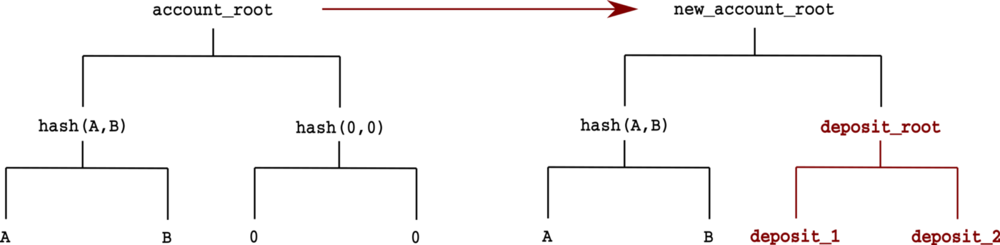

# 比特币上的 ZK-Rollups
> 比以太坊更具可扩展性

ZK-Rollups 被认为是以太坊 Layer 2 扩容解决方案的圣杯。

> 总的来说，我个人的看法是，在短期内，Optimistic-Rollups 可能会在通用 EVM 计算中胜出，而 ZK-Rollups 可能会在简单支付，交换和其他特定于应用程序的用例中胜出，但从中长期来看，随着 ZK-SNARK 技术的改进，ZK-Rollups 将在所有用例中胜出。  — [Vitalik](https://vitalik.ca/general/2021/01/05/rollup.html)

我们已经直接在比特币上实现了第一个 ZK-Rollups (ZKR)。此外，我们展示了为什么 ZKR 在比特币上比在以太坊上效果更好。

## ZK-Rollups 如何在以太坊中运作

ZKR 的核心是利用 ZK-SNARK 证明的简洁性：验证某些计算是否正确完成比重新执行它更有效。不是处理链上的每笔交易，而是首先将合约的多个交易发送给协调器（又名定序器/中继器），而不是矿工。协调器将它们“滚动”/捆绑到单个事务中。该交易包含一个简洁的证明，证明所有这些批量交易都被忠实处理，将合约从 state1 更改为 state2，并发送给矿工。


<center><a href="https://github.com/barryWhiteHat/roll_up_token">ZK Rollup</a></center>

由于交易处理的所有繁重工作都外包给了链外，因此区块链可以在给定的时间间隔内处理更多的交易，从而扩大规模。zkSNARK 证明确保了链下状态转换的正确性，使协调者无法提交无效的状态转换。这使得 ZKR 成为吸引人的 L2 可扩展性解决方案，因为它允许在不牺牲 L1 安全性的情况下进行扩展，这与 [Plasma 和 Optimistic Rollup](https://www.preethikasireddy.com/post/a-normies-guide-to-rollups) 等许多其他 L2 解决方案不同。

## ZK-Rollups 代币

我们以代币为例来演示如何使用 ZKR。


<center><a href="https://www.preethikasireddy.com/post/a-normies-guide-to-rollups">以太坊上的Rollup
</a></center>

主链上有一个 Rollup 合约，跟踪根状态。“根状态”是默克尔树的根。树的每一片叶子都是一个帐户，由其所有者的公钥或地址及其属性（例如余额）组成。


<center>帐户形成默克尔树</center>

在以下示例中，将两笔存款被打包为一个交易。




<center><a href="https://github.com/barryWhiteHat/roll_up_token">状态交易
</a></center>

## 比特币上的Rollup

我们已经在比特币上实现了Rollup合约。它确保在处理完一批事务后，当前根状态被正确地更新。

```js

import "zksnark.scrypt";

// a simple zk Rollup for token transfers
contract ZKRollup {
    const VerifyingKey vk;

    @state
    int acount_root;

    public function verify(int new_account_root, Proof proof, SigHashPreimage txPreimage) {
        int[ZKSNARK.N] inputs = [this.account_root, new_account_root];

        // verify proof
        require(ZKSNARK.verify(inputs, proof, this.vk));

        // update root
        this.account_root = new_account_root;
        require(this.propagateState(txPreimage, SigHash.value(txPreimage)));
    }
}
```

它跟踪的唯一状态是第 `8` 行中帐户树的根。有效性证明在第 `14` 行使用我们之前的 [zk-SNARK 库](https://xiaohuiliu.medium.com/zk-snarks-on-bitcoin-239d96d182bd)进行验证。Root 在第 `17` 行更新。第 `5` 行的验证密钥来自 zk-SNARK 的设置阶段。

## 生成 ZKR 证明

我们需要以 zk-SNARK 友好的方式对我们的事务处理逻辑进行编码。
一种流行的语言是 Circom。由于篇幅所限，我们不在这里介绍 Circom 语法，而是请读者参考 [circom 官方网站](https://docs.circom.io/)了解更多信息。

处理单个事务涉及：

1. 通过默克尔证明检查发件人帐户是否在树中
2. 验证发件人的签名
3. 更新发送者的余额并验证中间默克尔根
4. 更新接收方的余额
5. 更新默克尔树的根

我们可以像这样重用现有的 [Rollup Circom 代码](https://github.com/rollupnc/RollupNC_tutorial)。

```js
template ProcessTx(k){
    // k is depth of accounts tree

    // accounts tree info
    signal input accounts_root;
    signal private input intermediate_root;
    signal private input accounts_pubkeys[2**k, 2];
    signal private input accounts_balances[2**k];

    // transactions info
    signal private input sender_pubkey[2];
    signal private input sender_balance;
    signal private input receiver_pubkey[2];
    signal private input receiver_balance;
    signal private input amount;
    signal private input signature_R8x;
    signal private input signature_R8y;
    signal private input signature_S;
    signal private input sender_proof[k];
    signal private input sender_proof_pos[k];
    signal private input receiver_proof[k];
    signal private input receiver_proof_pos[k];

    // output
    signal output new_accounts_root;

    // 1. verify sender account exists in accounts_root
    component senderExistence = LeafExistence(k, 3);
    senderExistence.preimage[0] <== sender_pubkey[0];
    senderExistence.preimage[1] <== sender_pubkey[1];
    senderExistence.preimage[2] <== sender_balance;
    senderExistence.root <== accounts_root;
    for (var i = 0; i < k; i++){
        senderExistence.paths2_root_pos[i] <== sender_proof_pos[i];
        senderExistence.paths2_root[i] <== sender_proof[i];
    }

    // 2. check that transaction was signed by sender
    component signatureCheck = VerifyEdDSAMiMC(5);
    signatureCheck.from_x <== sender_pubkey[0];
    signatureCheck.from_y <== sender_pubkey[1];
    signatureCheck.R8x <== signature_R8x;
    signatureCheck.R8y <== signature_R8y;
    signatureCheck.S <== signature_S;
    signatureCheck.preimage[0] <== sender_pubkey[0];
    signatureCheck.preimage[1] <== sender_pubkey[1];
    signatureCheck.preimage[2] <== receiver_pubkey[0];
    signatureCheck.preimage[3] <== receiver_pubkey[1];
    signatureCheck.preimage[4] <== amount;

    // 3. debit sender account and hash new sender leaf
    component newSenderLeaf = MultiMiMC7(3,91){
        newSenderLeaf.in[0] <== sender_pubkey[0];
        newSenderLeaf.in[1] <== sender_pubkey[1];
        newSenderLeaf.in[2] <== sender_balance - amount;
    }

    // update accounts_root
    component computed_intermediate_root = GetMerkleRoot(k);
    computed_intermediate_root.leaf <== newSenderLeaf.out;
    for (var i = 0; i < k; i++){
        computed_intermediate_root.paths2_root_pos[i] <== sender_proof_pos[i];
        computed_intermediate_root.paths2_root[i] <== sender_proof[i];
    }

    // check that computed_intermediate_root.out === intermediate_root
    computed_intermediate_root.out === intermediate_root;

    // 4. verify receiver account exists in intermediate_root
    component receiverExistence = LeafExistence(k, 3);
    receiverExistence.preimage[0] <== receiver_pubkey[0];
    receiverExistence.preimage[1] <== receiver_pubkey[1];
    receiverExistence.preimage[2] <== receiver_balance;
    receiverExistence.root <== intermediate_root;
    for (var i = 0; i < k; i++){
        receiverExistence.paths2_root_pos[i] <== receiver_proof_pos[i];
        receiverExistence.paths2_root[i] <== receiver_proof[i];
    }

    // credit receiver account and hash new receiver leaf
    component newReceiverLeaf = MultiMiMC7(3,91){
        newReceiverLeaf.in[0] <== receiver_pubkey[0];
        newReceiverLeaf.in[1] <== receiver_pubkey[1];
        newReceiverLeaf.in[2] <== receiver_balance + amount;
    }

    // 5. update accounts_root
    component computed_final_root = GetMerkleRoot(k);
    computed_final_root.leaf <== newReceiverLeaf.out;
    for (var i = 0; i < k; i++){
        computed_final_root.paths2_root_pos[i] <== receiver_proof_pos[i];
        computed_final_root.paths2_root[i] <== receiver_proof[i];
    }

    // output final accounts_root
    new_accounts_root <== computed_final_root.out;
}
```

<center><a href="https://github.com/rollupnc/RollupNC_tutorial/blob/master/4_single_tx/sample_circuit.circom">rollup.circom</a></center>

[这里](https://medium.com/coinmonks/hands-on-your-first-zk-application-70fe3a0c0d82)是对上述代码的详细解释。

## 多笔交易

只有当多个事务一起批处理时，rollup的优点才会显现出来。仅当批次中的所有交易都有效时，生成的证明才有效。

```js
    for (var i = 0; i < 2**m - 1; i++) {

        // transactions existence and signature check
        txExistence[i] = TxExistence(m);
        txExistence[i].from_x <== from_x[i];
        txExistence[i].from_y <== from_y[i];
        txExistence[i].to_x <== to_x[i];
        txExistence[i].to_y <== to_y[i];
        txExistence[i].amount <== amount[i];
        txExistence[i].token_type_from <== token_type_from[i];

        txExistence[i].tx_root <== tx_root;
        ...

```

<center><a href="https://github.com/therealyingtong/RollupNC/blob/cb706028bdd97cf454cb79e7725facf2499ee199/snark_circuit/multiple_tokens_transfer_and_withdraw.circom#L83">处理多个事务</a></center>

#  总结

ZKR 将交易数据存储在第 1 层（L1）的链上，以实现[数据可用性](https://blog.polygon.technology/the-data-availability-problem-6b74b619ffcc/)。底层 L1 的存储成本为 ZKR 的可扩展性增益设置了上限。因此，ZKR 在比特币上的效果比在以太坊上要好得多，因为前者的存储成本比后者[便宜几个数量级](https://blog.csdn.net/freedomhero/article/details/117924646)。


此外，由于 zk-SNARK 是通用的，一旦在比特币上部署了 rollup 智能合约，许多现有的在其他区块链（如 Circom 和 [ZoKrates](https://zokrates.github.io/)）上设计的 ZKR 工具可以直接在比特币中重复使用。这意味着 ZKR 可用于今天在比特币上扩展应用程序。

---------------

## 参考

[1] https://blog.matter-labs.io/optimistic-vs-zk-rollup-deep-dive-ea141e71e075

[2] https://www.preethikasireddy.com/post/a-normies-guide-to-rollups

[3] https://github.com/barryWhiteHat/roll_up_token

[4] https://blog.matter-labs.io/optimistic-vs-zk-rollup-deep-dive-ea141e71e075
