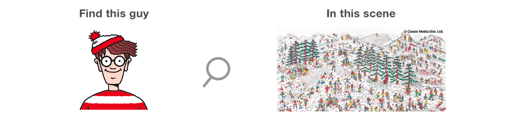
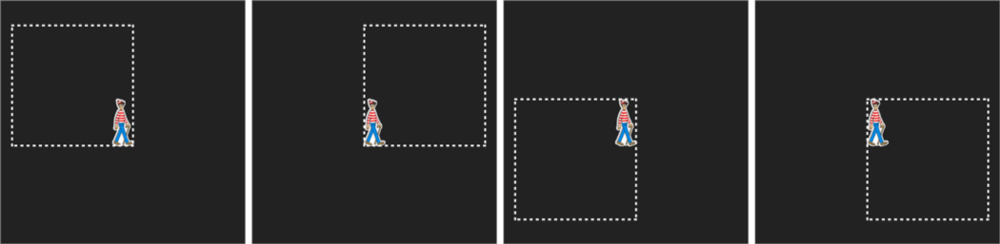

# 零知识证明以及其在比特币中的应用

在通过一个例子介绍了零知识证明 (ZKP) 之后，我们展示了如何将它用作一个强大的工具来增加隐私并进一步开发许多构建在上面的应用程序。

## 零知识证明

零知识证明允许声称知道秘密的一方（即证明者）说服另一方（即验证者）该声明是有效的，同时不泄露秘密。

## Waldo 在哪裡？

寻找 Waldo 是一款游戏，您必须在与他相似的人海中找到 Waldo。



Peggy（证明者）告诉 Victor（验证者）她知道 Waldo 在场景中的位置，但她不想向他展示他的确切位置。那么，她如何向他证明她找到了 Waldo 而不显示他的确切位置？

Peggy 找到了一大块硬纸板，在中间挖了一个 Waldo 形状的洞。


然后，她将 Waldo 的位置（在一张纸上）用胶带粘在纸板的背面，这样 Waldo 就在占据中心的 Waldo 形状的洞。当 Peggy 用胶带粘好纸板时，Victor 应该站在纸板前。


当 Victor 从洞里看到 Waldo 时，他确信 Peggy 的说法是有效的，但他不知道 Waldo 的确切位置



## 在比特币中的应用

由于零知识证明的隐藏特性，它可以在需要隐私的许多情况下使用。更重要的是，它也可以作为构建更复杂协议的基础，如下所示。

### 通过加密和交换的托管<sup>1</sup>

Alice 想用比特币支付 Bob 购买商品。Alice 和 Bob 分别生成随机私钥 **a/b**, 对应公钥 **A/B**。Alice 在托管人的公钥 **E** 下加密她的私钥 **a** 并将密文 **c = Enc(a, E**) 发送给 Bob。她还向 Bob 发送了一个零知识证明，证明 **c** 确实是 **a** 通过 **E** 加密的。反之亦然，Bob 做同样的事情。

1. 然后，Alice 将资金发送到共享公钥 S = A+B，以支付商品。在没有争议的情况下，Alice 发送 **a** 给 Bob，Bob 可以转移资金。
2. 在存在争议的情况下，托管人会选择获胜者。如果获胜者是 Bob，他将 **c** 发送到托管。托管人解密 **c** 以获得 **a** 并将其发送回 Bob，后者可以赎回资金。同样，如果 Alice 是赢家，她可以拿走这笔资金。

与传统的 2-of-3 多重签名托管相比，有几个优点：

1. 资金被锁定在一个普通的比特币 P2PKH 地址中。只有相关方知道涉及托管，从而增加隐私。
2. 在没有争议的情况下，托管人不必参与存款或取款，从而有可能降低其运营成本。
   
我们已经实现了完整的协议，下面列出了代码的零知识证明部分。


```javascript

const encryptionResultA = ve.encrypt(ucPubKeyEscrow, privKeyA.toBuffer());

const proofA = ve.prove(ucPubKeyEscrow, encryptionResultA);
// zero knowledge proof: Bob can verify if encryptionResultA is encrypted privKeyA (without knowing it) 
// with ucPubKeyEscrow, whose corresponding public key is ucPubKeyA
const isVerifiedA = ve.verify(proofA, ucPubKeyEscrow, ucPubKeyA, encryptionResultA.ciphertexts);
assert(isVerifiedA);

```


[gist escrow_zkp.js](https://gist.github.com/xhliu/9f759cb80e079dbcda6f0742be18294a)

##  脚注
--------------------------------------------------

[1]: [Escrow Protocols for Cryptocurrencies: How to Buy Physical Goods Using Bitcoin](https://link.springer.com/chapter/10.1007/978-3-319-70972-7_18). Steven Goldfeder, 2017