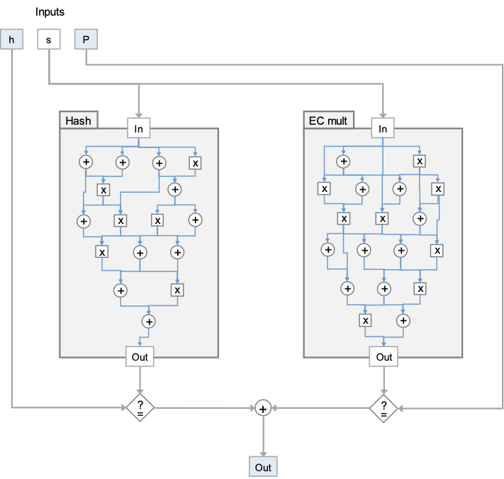
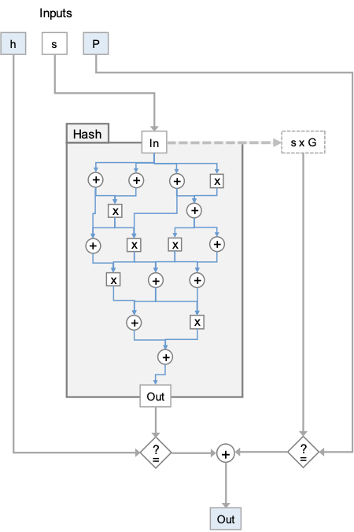
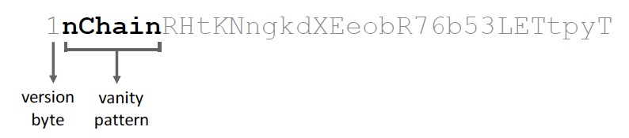

# 零知识密钥声明证明

nChain 白皮书 #0488 题为“零知识密钥声明证明”，介绍了一种零知识证明 (ZKP)，可证明与给定公钥对应的私钥满足特定要求，同时保持私钥机密。我们已经实现了它，并将其应用于无需信任地购买[比特币荣耀地址](https://academy.bit2me.com/en/what-is-a-vanity-address/)。它可以推广到广泛的应用程序，其中可以在相互不信任的各方之间购买秘密信息，而无需受信任的第三方。

## 零知识密钥声明证明

正如我们[之前介绍过的](https://blog.csdn.net/freedomhero/article/details/125598868)，零知识证明让一方说服另一方他知道验证声明的秘密，同时不透露秘密。零知识密钥声明证明 (ZKKSP) 是一种特殊类型的 ZKP，其中秘密是对应于已知公钥的私钥。私钥满足其他约束，例如散列到给定值。


<center>带哈希的密钥声明</center>

nChain 白皮书介绍了一种有效的 ZKKSP 方法。

与 zk-SNARKS 等一般陈述的零知识证明相比，ZKKSP 具有以下几个显着优势：

1. 与 zk-SNARKS 等一般陈述的零知识证明相比，ZKKSP 具有以下几个显着优势：

2. zk-SNARKS 中的密钥声明证明需要一个椭圆曲线乘法电路，导致证明生成的计算要求极高，并且证明方的证明密钥过大。相比之下，ZKKSP 通过以下方式删除电路：
    - 在与公钥相同的 ECDSA 椭圆曲线上工作
    - 检查公钥和生成的 zk-proof 之间的一致性；具体来说，检查与 zk-proof 中嵌入的承诺的一致性¹。

在 ZKP 中，语句/计算通常编码在算术电路中，由加法和乘法门组成。如图 1 所示，zk-SNARKS 包含用于散列函数和椭圆曲线乘法的子电路。后面的电路根据已知的 ECDSA 公钥检查一致性。ZKKSP 只使用了哈希电路，去掉了其他的电路，其他的电路至少比哈希电路大一个数量级。有兴趣的读者可以参考白皮书了解更多详细信息，由于篇幅限制，我们在此省略。



<center>图 1：zk-SNARKS² 中声明 1 的复合电路示意图</center>



<center>图 2：ZKKSP³ 中声明 1 的复合电路示意图</center>

## 实现

我们 fork [ZoKrates](https://github.com/sCrypt-Inc/zokrates/tree/key-statement-proof) 的来生成 SHA256 的算术电路。修改电路格式后，我们实现了白皮书中列出的剩余密钥声明证明。

### ZoKrates

ZoKrates⁴ 是以太坊上 zkSNARKs 的工具箱。它由特定领域的语言、编译器以及用于生成证明和验证证明的智能合约。下面是一个用 ZoKrates 编写的源程序，用于检查 `sha256(preimage) == h`⁵。


```
import "hashes/sha256/256bitPadded" as sha256
import "utils/pack/u32/unpack128" as unpack128
import "utils/pack/u32/pack128" as pack128

def main(private field[2] preimage, field h0, field h1):

    u32[4] a_bits = unpack128(preimage[0])
    u32[4] b_bits = unpack128(preimage[1])
    u32[8] privkey = [...a_bits, ...b_bits]
    u32[8] res = sha256(privkey)

    assert(h0 == pack128(res[0..4]))
    assert(h1 == pack128(res[4..8]))

    return
```

<center>sha256.zok: 在zokrate中验证 sha256(preimage) == h </center>

### Workflow

证明者按顺序运行以下命令以生成证明。

```bash
# 1: compile
> zokrates compile -i sha256.zok

# 2: compute witness: all inputs are in decimal
# first two arguments make up the preimage/private key, which are kept private
# last two arguments make up the hash, which are public
> zokrates compute-witness -a 314077308411032793321278816725012958289 316495952764820137513325325447450102725 67428615251739275197038733346106089224 232995379825841761673536055030921300908 

# 3: generate a proof
> zokrates generate-key-proof --output proof.json
```

<center>证明者生成证明</center>

证明者将生成的证明在 proof.json 中发送给验证者。验证者运行以下命令来检查公钥是否与哈希值匹配。请注意，由于 [Fiat-Shamir 启发式](https://en.wikipedia.org/wiki/Fiat%E2%80%93Shamir_heuristic)，此证明是非交互式的，并且不需要证明者和验证者之间的交互。

```bash
> zokrates verify-key-proof --proof-path proof.json -p 0494d6deea102c33307a5ae7e41515198f6fc19d3b11abeca5bff56f1011ed2d8e3d8f02cbd20e8c53d8050d681397775d0dc8b0ad406b261f9b4c94404201cab3

# if everything goes right, you shall see something like this
Performing verification...
total gates:  199624...
Private key corresponding to public key 0494d6deea102c33307a5ae7e41515198f6fc19d3b11abeca5bff56f1011ed2d8e3d8f02cbd20e8c53d8050d681397775d0dc8b0ad406b261f9b4c94404201cab3 hashes to 32ba476771d01e37807990ead8719f08af494723de1d228f2c2c07cc0aa40bac
```
<center>验证者验证证明</center>

你可以在我们的 [Github](https://github.com/sCrypt-Inc/zokrates/tree/key-statement-proof) 上找到完整的代码。


## 应用场景：外包虚名地址生成

本节介绍将 ZKKSP 应用于外包[比特币荣耀地址](https://academy.bit2me.com/en/what-is-a-vanity-address/)生成。

由于搜索荣耀地址可能在计算上很昂贵，因此将搜索外包是很常见的。传统上，要么买方在卖方获得付款之前获得所需价值，要么卖方在释放所需价值之前获得付款，或者他们都必须信任托管服务。通过使用 ZKKSP，可以使荣耀地址的销售变得无需信任。



<center>具有“nChain” 开头的比特币主网荣耀地址</center>

对此的协议详述如下：

1. 买卖双方就所需的荣耀地址批评规则和价格（BSV）达成一致，并建立沟通渠道（不需要安全）。

2. 买方生成安全随机密钥 `sk_B` 和对应的椭圆曲线公钥 `pk_B = sk_B * G`。

3. 买方将 `pk_B` 发送给卖方。

4. 然后，卖方通过更改 `i` 在派生自 `pk = pk_B + i * G` 的 Base58 编码地址中执行所需模式的搜索。

5. 当找到具有所需模式的地址时，卖方保存该值，向买方发出信号并将 `pk_S = i * G` 和 SHA256 哈希发送给他们。

6. 卖家还向买家提供了一个 ZKKSP，其原像为 `pk_S` 对应的私钥。

7. 买方验证证明，同时确认对应的地址 `pk = pk_B + pk_S` 符合约定的模式。在这一点上（通过证明），买方知道只要知道 `i`，他就能够导出荣耀地址 `(sk_B + i)` 的完整私钥，并且该特定值散列为 `h = H(i)`。

8. 然后，买方构建一个哈希时间锁定合约 (HTLC) 交易 Tx_1，其中包含一个包含约定费用的输出。此输出可以通过两种方式解锁：
    - 有卖家的签名和哈希原像，i，随时。
    - 指定时间后有买家签名（OP_CLTV⁶）

9. 然后，买方签署并将此交易广播到区块链，在那里它被挖掘进区块。

10. 确认后，卖家可以通过提供交易 `Tx_2` 来在 `Tx_1` 的输出中索取费用，交易 `Tx_2` 提供他们的签名和 `i` 值以解锁散列锁，然后在区块链上显示。

11. 买家计算最终荣耀地址私钥`sk = sk_B + i`，其中`pk = sk * G`

12. 如果卖家没有在指定的OP_CLTV时间之前提供 `i` 值，那么买家可以提供他们的签名来收回费用（以防止由于买家不合作而造成费用损失）。

这个交易是完全原子化且无需信任的，这意味着买方只有在提供有效的`𝑖` 值 时才能获得报酬，该值在区块链上公开披露。此外，由于私钥的拆分，甚至卖方也不知道完整的私钥。

## Summary

我们已经展示了如何证明密钥声明，其中秘密私钥哈希散列到给定值。虽然乍一看很原始，但 ZKKSP 非常强大，可以通过两个一般步骤实现许多原子公平交易：

1. 卖方使用 ZKKSP 向买方证明他知道后者需要的秘密，并且该秘密散列到给定值；
2. 买方建立了一个智能合约，只有在给出哈希原像时才会支付。

请注意，第 1 步是在链下完成的，计算量很大，而第 2 步是在链上完成的，计算量极轻。

可以应用相同的技术来要求私钥满足其他要求（即电路），例如以给定模式开始或结束。

## 致谢

这是 nChain Limited 和 sCrypt Inc. 的联合工作。

-------------

[1] 这些可以通过电路可满足性的非简洁证明系统或基于离散对数的 SNARK 来实现。我们已经实现了前者。

[2] 内部门仅用于说明目的——实际电路将有 1000 个门。

[3] 电路检查哈希的输出是否等于 EC 公钥：以蓝色突出显示的值向验证者显示，所有其他值都被加密。

[4] ZoKrates — [可扩展的隐私保护链下计算](https://ieeexplore.ieee.org/document/8726497)，2018 年

[5] preimage 和 h 都分为两部分，因为基本类型 `field` 不能容纳 256 位。

[6] [BSV 上的“OP_CLTV”](https://blog.csdn.net/freedomhero/article/details/107306604)