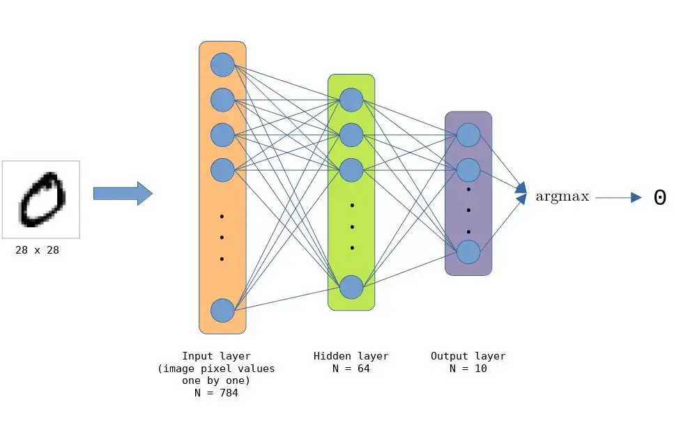

# BSV 上的零知识隐私机器学习

[此前](https://github.com/sCrypt-Inc/article/blob/4a045873288ec274320fc56105e0a2155e5c3305/Running%20Deep%20Neural%20Networks%20on%20Bitcoin/Running%20Deep%20Neural%20Networks%20on%20Bitcoin.md#L9-L10)，我们已经演示了在比特币上运行一个成熟的深度神经网络，其中机器学习 (ML) 算法的输入和模型都是公开的。在实践中，通常希望将输入或模型保持在链下并因此保持私有，同时仍确保 ML 算法如实运行。我们通过将零知识证明 (ZKP) 应用于 ML 来实现这一点。


## 零知识链上机器学习

涉及 ML 时，有两类隐私信息。

## 隐私输入

模型的输入是隐私的，但模型本身是公开的。这对于涉及敏感和隐私数据的应用程序特别有用，例如财务记录、生物识别数据（例如指纹、面部）、医疗记录和位置信息。例如，可以证明他已经超过21岁而无需透露他的年龄。或者保险公司使用信用评分模型进行贷款审批。该模型是为提高透明度而公开的，但申请人的工资和银行对账单等输入内容应保密。

## 隐私模型

模型的输入是公开的，但模型本身是私有的，通常是因为它是知识产权和专有的。例如，我们使用一家私人公司拥有的肿瘤分类模型来从图像中检测肿瘤。在对公共数据集进行分类时，该模型被证明具有 `99%` 的准确率。公司可以只发布其模型的密码承诺，即所有模型参数的哈希。我们可以确定该模型是合法的，虽然没有看到它。为了公平起见，密码学承诺还确保将相同的模型应用于每个人。这在例如根据候选人的公开信息对候选人进行排名的录取模型中是需要的。


ZKP 非常适合在使用链上 ML 时保留隐私，因为它可以在链下隐藏信息，同时证明 ML 推理是正确的。

## 手写数字分类

作为演示，我们实现了一个简单的手写数字分类模型。该模型使用来自 [MNIST 数据集](http://yann.lecun.com/exdb/mnist/)的标记示例进行训练。该模型的架构与我们用于[完全链上模型](https://xiaohuiliu.medium.com/running-deep-neural-networks-on-bitcoin-b8f48eddce8e)的架构非常相似。




我们使用 [ZoKrates](https://github.com/sCrypt-Inc/zokrates) 构建 ZK 电路，它可以通过简单地使用关键字 `private` 声明它来简单地将任何输入设为私有。


### 隐私输入

```js
def main(private u64[N_NODES_IN] model_inputs
         u64[N_NODES_HL][N_NODES_IN] weights0, \
         u64[N_NODES_OUT][N_NODES_HL] weights1, \
         u64[N_NODES_HL] biases0, \
         u64[N_NODES_OUT] biases1, \) {
    u64[N_NODES_HL] step0 = apply_weights0(model_inputs, weights0);
    u64[N_NODES_HL] step1 = add_biases0(step0, biases0);
    u64[N_NODES_HL] step2 = apply_relu(step1);
    u64[N_NODES_OUT] step3 = apply_weights1(step2, weights1);
    u64[N_NODES_OUT] step4 = add_biases1(step3, biases1);
    u64 res = argmax(step4);

    assert(res == TARGET_CLASS);
    return;
}
```

从上面的代码中，我们可以看到模型的输入 `model_inputs` 作为私有参数传递，同时模型参数（权重和偏差）是公开的。一旦我们将输入传递给模型，电路就会对数据执行所有模型操作并输出模型预测/类别。

### 隐私模型

以下是将模型设为私有的代码。

```js
def main(private u64[N_NODES_HL][N_NODES_IN] weights0, \
         private u64[N_NODES_OUT][N_NODES_HL] weights1, \
         private u64[N_NODES_HL] biases0, \
         private u64[N_NODES_OUT] biases1, \
         u64[N_TEST_EXAMPLES][N_NODES_IN] test_examples, \
         u64[N_TEST_EXAMPLES] test_labels) {
    u32 mut correct = 0;

    for u32 idx_test_example in 0..N_TEST_EXAMPLES {
        u64[N_NODES_HL] step0 = apply_weights0(test_examples[idx_test_example], weights0);
        u64[N_NODES_HL] step1 = add_biases0(step0, biases0);
        u64[N_NODES_HL] step2 = apply_relu(step1);
        u64[N_NODES_OUT] step3 = apply_weights1(step2, weights1);
        u64[N_NODES_OUT] step4 = add_biases1(step3, biases1);
        u64 res = argmax(step4);

        u32 to_add = if res == test_labels[idx_test_example] { 1 } else { 0 };
        correct = correct + to_add;
    }

    assert((correct * 100) / (N_TEST_EXAMPLES * 100) >= TARGET_CA);
    return;
}
```

这里我们不传递模型输入数据，而是将模型参数本身作为隐私输入。使用这些秘密参数，电路执行模型的所有必要操作，并将结果与​​一批测试示例进行比较。如果模型达到某个分类准确率 (CA) 阈值，则执行成功。

[第一个场景](https://github.com/sCrypt-Inc/scrypt-ml/blob/master/zk/private-model/zokrates/mnist/circuits/root.zok)和[第二个场景](https://github.com/sCrypt-Inc/scrypt-ml/blob/master/zk/private-inputs/zokrates/mnist/circuits/root.zok)的完整代码都可以在 GitHub 上找到。

# 总结

我们已经演示了如何利用 zk-SNARKS 的 ZK 属性进行链上机器学习。这允许我们隐藏 ML 计算的特定部分。


-------------------------------

参考：

[零知识机器学习](https://0xparc.org/blog/zk-mnist)