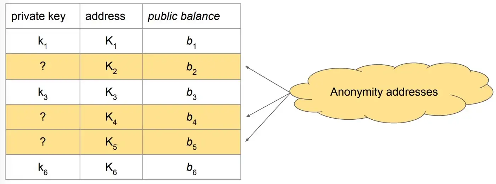

# 加密货币交易所偿付能力的零知识证明

> 如何检测下一个 FTX 和 Mt. Gox

加密货币交易所 FTX 的内爆导致数十亿客户资金流失，这是加密货币历史上交易所破产的最新例子。历史可以追溯到 2014 年，当时处理 `70%` 比特币交易的历史最悠久、规模最大的交易所 Mt. Gox 丢失了用户的 `850,000` 个比特币。

如今，许多用户更喜欢将他们的加密货币资产存储在集中式交易所中，以便于使用，类似于网上银行，以避免自己管理加密密钥的困难和风险。

不幸的是，将资产存储在交易所会使用户面临因外部或内部盗窃而在交易所丢失资产的风险。

我们展示了一种交易所以加密方式证明偿付能力的方法，这意味着它的资产覆盖了它的负债。该证明不披露任何私人信息，包括其客户、其控制的地址和总负债。所提出的方法可以附加受信任的审计，这可能是昂贵的，或者是独立应用的。

## 原始的方法

交易所证明其偿付能力的一种基本方法是公开披露所有用户负债及其控制的所有比特币地址的。任何一方都可以计算其总负债和资产，从而检查其是否具有完全偿付能力。

每个用户都可以独立验证他是否在负债数据集中。如果遗漏任何用户，则可以发现交易所作弊。

交易所可以通过数字签名或将余额转移到新地址来证明其拥有任何地址的私钥。


这种完全透明的方法显然是有问题的，因为它会泄露有关交易所及其用户的商业敏感信息。我们需要一种保护隐私的替代方案。

## 密码学基础

### 佩德森 (Pedersen) 承诺 

Pedersen 对消息 `x` 的承诺定义为：


`G` 和 `H` 是椭圆曲线的独立生成元。 `r` 是一个随机值，称为致盲因子。

与基于哈希的承诺（例如 SHA256）相比，Pedersen 承诺是 *加法同态* 的。这意味着在不知道 `x` 和 `y` 这两个值的情况下，可以将它们相应的承诺相加以计算其总和的承诺。


### 零知识范围证明 (ZKRP)

ZKRP 是一种特殊类型的零知识证明，它显示一个数字在一定范围内，而不公开数字。Bulletproof 是一种高效的 ZKRP 结构。

### 资产证明

在资产证明（又名储备证明）中，交易所充当其总资产的证明者，任何一方都可以扮演验证者的角色。

为防止交易所隐私数据泄露，采取了以下措施。

1. 更多的匿名地址被添加到完整的资产集中，交易所不知道其私钥。这混淆了交易所拥有的地址集。



2. 诸如 zk-SNARK 之类的 ZKP 用于为每个地址证明以下陈述：

> “要么我知道地址对应的私钥，承诺就是地址的余额

> 或者

> 我不知道私钥，承诺的值为 0。”

3. 由于其同态性质，总资产余额可以通过对步骤 2 中证明的所有个人 Pedersen 承诺求和来获得。请注意，未披露专有且敏感的总资产，仅披露其 Pedersen 承诺。

最终结果是 Pedersen 对总资产 commit(assets) 的承诺，即交易所知道全套比特币地址子集的私钥。

## 负债证明

接下来，交易所证明它欠所有客户的硬币总数。每个客户都确认自己被包括在内。

### 求和默克尔树

为此，交易所将所有用户组织成 Merkle 树的变体。每片叶子代表一个用户和她的余额。与规范的 Merkle 树相比，求和 Merkle 树进行了两个修改。

1. 除了散列之外，每个节点中还添加了一个余额字段。节点的余额是其两个子节点的总和。
2. 使用 Pedersen 承诺代替 SHA256 等哈希。


树的根包含总负债的承诺。交易所签署根并将其发布在例如比特币上。每个客户都可以根据已发布的根请求包含他们的 Merkle 证明。如果有足够数量的客户独立验证，则大概率可以抓到作弊交易所。

### 范围证明

不诚实的交易所可以通过包含负余额的假用户来欺骗，从而减少他们的总负债。为了防止这种攻击，交易所还提供了一个 ZKRP，叶节点的每个客户都有一个非负余额，但没有透露余额本身。请注意，交易所没有动力添加具有正余额的虚假用户，因为这会增加他们的负债。

### 偿付能力证明


一旦交易所完成资产和负债证明，我们就可以计算其余额的承诺。

```
commit(balance) = commit(assets) — commit(liabilities)
```

交易所有两种方式来证明余额是非负的，即交易所是有偿付能力的。

1. 直接打开承诺。
2. 给定承诺，使用 ZKP 证明余额是非负的。

## 讨论

我们的偿付能力证明只是交易所提高透明度和提高客户信心的初步步骤。要在实践中采用它还有许多其他措施，交易所会定期发布证明。

例如，一群资不抵债的交易所可以串通一气，通过用它们的集体资产来覆盖每个交易所的个人负债。从本质上讲，没有什么能阻止单个比特币地址的资产被用于各种交易所的偿付能力证明。为了对抗这种攻击，交易所的资产证明需要额外证明其使用的地址集与另一个交易所的地址集不相交。

# 参考

[1] [为比特币交易所提供隐私保护的偿付能力证明 Real World Crypto 2016：幻灯片](https://eprint.iacr.org/2015/1008.pdf)

[2] [基于 ZK-SNARK 的比特币交易所资产证明协议](https://arxiv.org/abs/2208.01263)