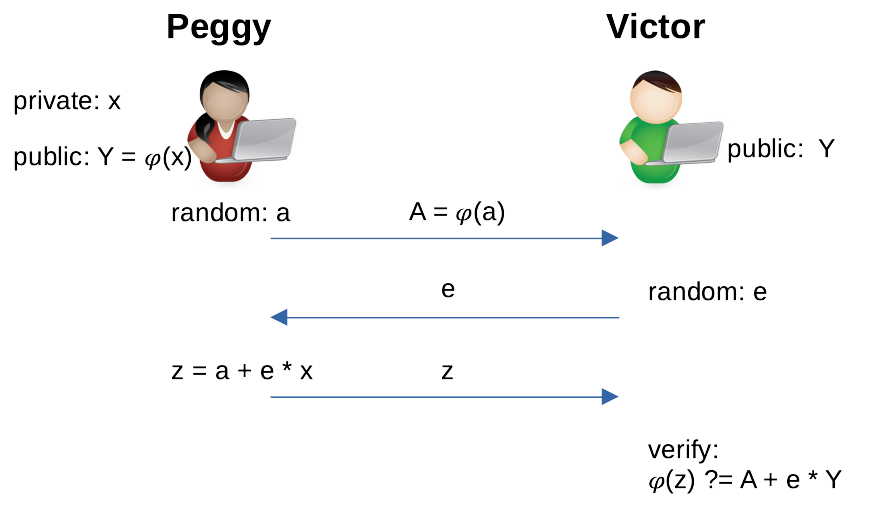

# 零知识谜题

> 在没有分叉的情况下升级比特币的椭圆曲线等等

这是我们与 nChain 合作的第三部分。我们要特别感谢 Enrique Larraia 博士撰写本文所依据的白皮书并帮助指导实施。

一个标准的支付交易可以看作是一个公钥迷题。如果他知道给定地址/公钥的相应私钥，他就可以花费硬币。与会透露原像的哈希谜题不同，公钥谜题的解决方案，即私钥，永远不会被透露。这是使用[数字签名](https://wiki.bitcoinsv.io/index.php/Elliptic_Curve_Digital_Signature_Algorithm)实现的，这是一种[零知识证明](https://en.wikipedia.org/wiki/Zero-knowledge_proof)：一个人在不公开私钥的情况下证明私钥的知识。


我们使用标准的零知识证明技术来概括私钥的知识证明。因此，我们可以构建任意复杂的谜题，称为零知识 (ZK) 谜题，作为支出条件。一些用例包括：

* 支付给椭圆曲线上的公钥，该椭圆曲线不同于当今比特币中使用的曲线 [secp256k1](https://wiki.bitcoinsv.io/index.php/Secp256k1)

* 支付给一组公钥，如果一个人知道任何一个公钥的私钥，就可以花费这些硬币，而无需透露是哪一个。

## ∑ 协议

**∑-协议**是一种零知识协议，用于在不公开值本身的情况下证明知道某种关系中的值。例如，证明知道[离散对数](https://en.wikipedia.org/wiki/Discrete_logarithm)，即给定 `g` 和 `y`，证明知道 `x` 满足 `gˣ = y` 的而不揭示 `x`。它由证明者 Peggy 和验证者 Victor 之间的三个步骤组成，称为承诺、挑战和响应，如下图所示（名称 ∑ 来源于形状）。


<center>图 1：∑ 协议</center>


例如，Peggy 想要让 Victor 相信她知道 `Y = 𝜑(x)` 中的 `x` 而不透露 `x`，其中 `𝜑` 是一个函数¹。双方都接收 `Y` 作为输入。

1. Peggy 使用随机数 `a` 计算承诺 `A`。她与 Victor 共享 `A`，但没有透露 `a`。
2. Victor 生成一个随机数 `e` 作为挑战并与 Peggy 共享。
3. Peggy 使用 `a` 和 `e` 计算答案 `z` 并返​​回给 Victor。


通过检查公共信息 `A`、`Y`、`z` 和 `e`，Victor 判断 Peggy 知道 `x` 是否等式成立。



<center>图 2：在 𝜑 下证明知道 x 的 ∑ 协议</center>

## Fiat-Shamir 启发式

上面的 ∑ 协议需要 Peggy 和 Victor 之间的交互。我们可以使用标准的 [Fiat-Shamir启发式](https://en.wikipedia.org/wiki/Fiat%E2%80%93Shamir_heuristic) 技术来消除交互。基本思想是使用像 sha256 这样的加密哈希函数 H 来模拟 Victor 的挑战 `e`。通过散列 `Y` 和 `A`，特定于协议执行，`e` 可以被视为随机²。证明知道 `x` 的新 ∑ 协议变为：


<center>图 3：在 𝜑 下证明知道 x 的 非交互式 ∑ 协议</center>

只有一步：Peggy 将证明 `(e, z)` 发送给 Victor。Victor 使用图 2 中的等式推导出 `A` 并检查 `e == H(Y || A)` 是否成立。

## 零知识谜题示例

我们将非交互式 ∑ 协议应用于比特币，其中 `𝜑(x) = x * G`，`G` 是生成点。

## 支付到通用公钥 (P2GPK)

我们使用∑协议，用证明 `(e，z)` 替换签名。它是标准 [Pay to Public Key](https://wiki.bitcoinsv.io/index.php/Bitcoin_Transactions#Pay_to_Public_Key_.28P2PK.29) (P2PK) 谜题的扩展。
以下代码实现了验证，使用了我们的[椭圆曲线库](https://xiaohuiliu.medium.com/elliptic-curve-arithmetic-in-script-cb0ab37e4f63)。


```js
// pay to a generic public key
contract P2GPK {
    // public key
    Point pk;

    public function unlock(int e, int z, SigHashPreimage preimage) {
        require(Tx.checkPreimage(preimage));

        // Compute A = z * G - e * PK
        Point zG = EC.multByScalar(EC.G, z);
        Point ePK = EC.multByScalar(this.pk, e);
        Point A = EC.addPoints(zG, EC.negatePoint(ePK));

        // Compute e = H(preimage || PK || A)
        bytes pk_ = EC.point2PubKey(this.pk);
        bytes A_ = EC.point2PubKey(A);
        int e_ = Utils.fromLEUnsigned(sha256(preimage + pk_ + A_));

        require(e == e_);
    }
}
```
<center><a href="https://github.com/sCrypt-Inc/boilerplate/tree/master/contracts/p2gpk.scrypt
">P2GPK 合约</a></center>

它与图 3 中的验证相同，只是我们还在 `H` 中添加了 `sighash` 原像，就像比特币签名当前所做的那样。否则，攻击者可以更改交易并将硬币重定向到他的地址，因为证明在解锁脚本中是公开的，即上述函数 `unlock()` 的参数。`H` 在第 `17` 行被执行 [SHA256](https://wiki.bitcoinsv.io/index.php/HASH256)运算。

与[内置签名检查](https://wiki.bitcoinsv.io/index.php/OP_CHECKSIG)相比，**P2GPK** 享有多项优势。

- 它可以使用比硬编码曲线 `secp256k1` 具有更高安全性的曲线，例如 [secp521r1](https://www.cryptosys.net/pki/eccrypto.html)。如果数十年来大量比特币由一个密钥控制，这可能是可取的。这也意味着通过使用现有的操作码³，比特币可以升级到更安全的签名方案，而不会破坏更改协议。

- 它可以重用其他地方的兼容密钥。例如，[PGP](https://datatracker.ietf.org/doc/html/rfc6637#section-11) 支持椭圆曲线密钥，比特币可以发送到 PGP 密钥，即使它们基于其他曲线。

# 总结

到目前为止，我们只将 ∑ 协议应用于单个谜题。∑ 协议是模块化的，并且可以通过使用例如逻辑串联/与 和并联/或 组合在一起。因此，我们可以构建更高级的谜题，例如：

支付到群组密码（P2GP）：任何知道任意群组密码的人都可以通过提供证明来花费资金，而无需透露使用了哪一个群组密码。这是 1-of-n 多重签名的概括，但更私密。例如，Peggy 证明她知道公钥 `Y` 或 `Z` 的私钥，即她知道 `x` 使得：

```
x * G == Y || x * G == Z
```

支付到阈值群组密码（P2TGP）:使用 AND 和 OR 组合的证明，一个组中的 `n` 个成员中的任何 `m` 个可以集体赎回 UTXO，而无需透露是哪些 `m` 个成员。这包括了 P2GP 和 `m-of-n` 多重签名。例如，一个 2-of-3 零知识谜题需要：

```
x * G == X && y* G == Y || x * G == X && z * G == Z || y * G == Y && z * G == Z
```

## 致谢

这是与 nChain 在 1617 号白皮书上的合作：Enrique Larraia 博士的零知识迷题。

------------------

[1] 𝜑 必须是[单向群同态](https://en.wikipedia.org/wiki/Group_homomorphism)，例如离散对数。

[2] 假设 H 是一个随机预言机。

[3] sha256、ripemd160等哈希函数可以被升级。