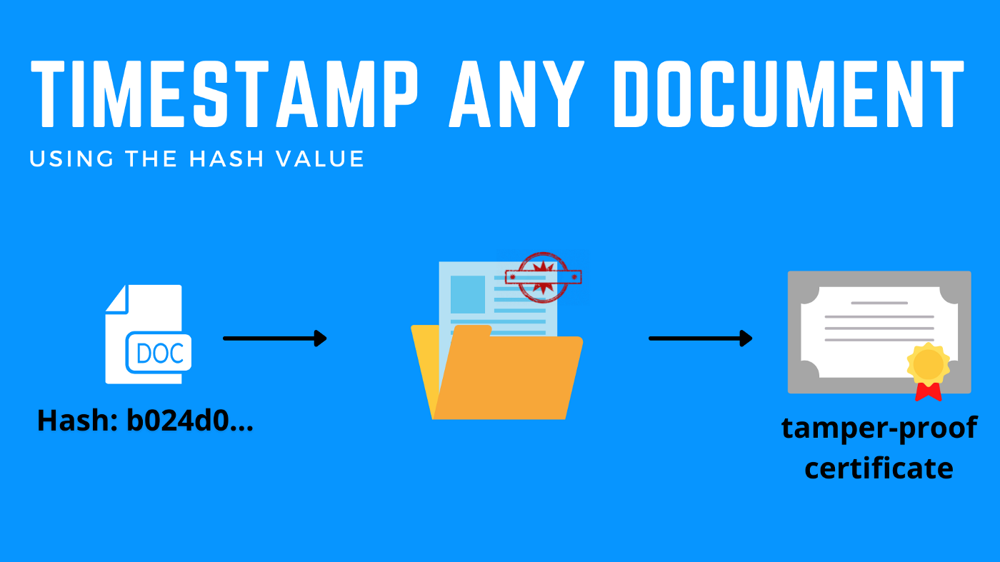
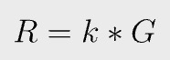
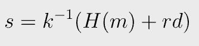
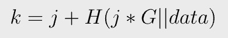
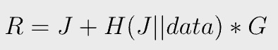

# 比特币中的零开销私人时间戳

> 通过重用 ECDSA 签名

比特币有许多潜在用途，远远超出支付范围。每个块都有一个受密码保护的时间戳。通过在交易和区块中记录数据，可以向任何外部审计员证明数据自特定日期以来未被篡改。时间戳对于时间敏感的数据特别有用：专利、保险索赔、发票、公证人等。

这通常通过 [OP_RETURN](https://wiki.bitcoinsv.io/index.php/OP_RETURN) 完成。我们介绍了一种使用比特币作为时间戳服务器的新颖替代方案，它既是私有的，又没有开销。

## ECDSA 签名

在 ECDSA 中，签名时会选择一个随机数 `k`，称为 `nonce`。`G` 是生成点。

等式 1

`r` 是 `R` 的 x 坐标。

等式 2

`H()` 是一个散列函数，`m` 是被签名的消息，`d` 是私钥。

签名是一对 `(r, s)`，并在区块链上公开。 `k` 和 `d` 都必须保密。

## 在 k 中嵌入数据

由于 `k` 可以是任意随机数，我们可以在其中嵌入数据，如下所示：

等式 3

`j` 是另一个类似 `k`的随机数。新的 `k` 和以前一样只是一个随机数，可以用来对消息进行签名，以同样的方式验证。

`r` 和 `R¹`，作为签名的一部分暴露在区块链上。

为了证明数据嵌入其中，证明者必须同时披露 J 和数据，如下所示：

等式 4

任何人都可以通过验证公式 4 是否成立来验证 `R` 是根据数据知识创建的，因为所有变量（`R`、`J`、数据、`G`）都是公开的。请注意，`J` 出现两次，有一次是在散列函数中。事后给定 `R`，不可能逆向它。因此，区块链上的 `R` 承诺了数据。

## 隐私

如果 Alice 有一些数据要时间戳，她可以花费她自己的一枚硬币并使用公式 3 创建 `k`。外部观察者只能在她的签名中看到 `r`，而无法知道它是否来自使用或不使用等式 3 生成的 `k`。时间戳交易看起来与普通支付交易相同，使其最终成为私有的。

## 无开销

如果 Alice 没有任何比特币，她可以要求 Bob 将她的数据打上时间戳嵌入到他的签名中。当 Bob 必须签名花费硬币时，时间戳对他来说没有任何额外的开销。Bob 可以是时间戳服务并为此收取费用。他只给Alice `J`，不透露`k`。 Alice 使用公式 4 来验证她的数据确实在区块链上以 `r` 提交。

## 什么进入了数据

通常，只需要提交原始数据的哈希值。数据也可以是 Merkle 树的根。

## 致谢

这个想法来自这个[麻省理工学院的讲座](https://ocw.mit.edu/courses/mas-s62-cryptocurrency-engineering-and-design-spring-2018/dea23a8d54a8bb2091e1bd6c4bd48d13_MAS-S62S18-lec16.pdf)，在 Schnorr 签名的背景下，与这里的 ECDSA 签名相比。

-------------------------------

[1] 严格来说，有两个相关点/Rs，给定一个椭圆曲线上的 `r`。我们可以验证它们中的任何一个是否使等式 4 成立。]