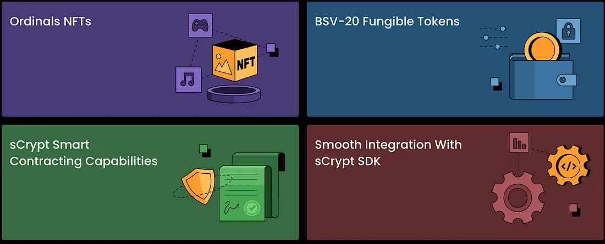

# sCrypt 现在支持 Ordinals 了

比特币社区对 [1Sat Ordinals](https://1satordinals.com) 的接受度正在迅速增加，已有超过 [`4800` 万个铭文](https://twitter.com/DevelopingZack/status/1711421162608112056)被铸造，这一新创新令人兴奋不已。 尽管令人兴奋，但 Ordinals 铭文的工具仍然不发达，这使得使用 Ordinals 进行构建具有挑战性。 更具体地说，缺乏智能合约严重限制了代币的功能。

Ordinals @ sCrypt

我们很高兴在我们的开发者平台中添加 1Sat Ordinals 支持，包括 NFT 及其同质化代币：BSV-20。 除了原生比特币/聪之外，sCrypt 智能合约现在还可以控制 Ordinals 代币的传输，为其本已强大的功能开辟了新的领域。

与其他代币协议相比，我们选择 Ordinals 是因为它具有独特的属性 1。

- **兼容性：** Ordinals 与 sCrypt 智能合约完全兼容，因为[它们可以与任何合约组合](https://github.com/sCrypt-Inc/article/blob/master/Integrate%20Ordinals%20with%20Smart%20Contracts%20on%20Bitcoin%20-%20Part%201/Integrate%20Ordinals%20with%20Smart%20Contracts%20on%20Bitcoin.md#L1)，而无需更改其语义。 任何现有合约都可以与 Ordinals 无缝集成，无需更改。
- **可扩展性：** Bitcoin SV 上的 1Sat Ordinals 大大改进了 BTC 上的 Ordinals，克服了其可扩展性问题。 它将 Ordinals 限制为 1 聪输出（因此得名），并且[不需要对整个区块链上的所有交易进行全局排序](https://xiaohuiliu.medium.com/integrate-ordinals-with-smart-contracts-on-bitcoin-part-4-2bf11e267d57)。
- **互操作性：** 多个项目已采用 Ordinals，包括 [1SatOrdinals.com](http://1satordinals.com/)、[GorillaPool](https://docs.1satordinals.com/public-apis)、[HandCash](https://docs.handcash.io/docs/minter-getting-started)、[Asset Layer](https://blog.assetlayer.com/1sat-ordinals-are-coming-to-asset-layer-ec13195a3532)、[RelayX](https://relayx.com/inscribe)、[Aym World](https://aym.world/) 和 [AskHAPI](http://askhapi.com/inscribe)。 这里有一个活跃的开发者社区，并且仅在本月就不断出现新的开发项目，例如 [Panda Wallet](https://coingeek.com/haste-arcade-dan-wagner-panda-wallet-is-built-in-such-a-way-that-it-doesnt-need-or-require-a-trusted-party-to-run/) 和 [FireSats](https://coingeek.com/firesats-is-a-new-bsv-wallet-for-nft-lovers/)。

- **更好的命名识别度：** Ordinals 比 Bitcoin SV 领域之外的任何其他代币协议都更受欢迎。 它已成为比特币衍生链上代币的同义词，包括 BTC、BCH、LTC 和 [Dogecoin](https://decrypt.co/140468/dogecoin-activity-surges-with-ordinals/)。

- **递归:** Ordinals 允许铭文[引用其他铭文](https://docs.ordinals.com/inscriptions/recursion.html)。 它允许人们在 Ordinals 上托管整个网站，通过[写入 html](https://ordfs.network/) 以及许多其他可能性。

我们正在发布 Ordinals SDK，[scrypt-ord](https://github.com/sCrypt-Inc/scrypt-ord/)，允许开发人员非常轻松地将 sCrypt 与 Ordinals 集成，而无需处理所有低级协议细节。 为了展示我们的 SDK，我们构建了一个全栈 Web 应用程序，使用户能够在去信任的市场中销售 Ordinal NFT。 用户可以使用钱包与应用程序进行交互。 分步教程就在[这里](https://docs.scrypt.io/tutorials/ordinal-lock)。 完整的 SDK 文档在[这里](https://docs.scrypt.io/tokens)。

我们迫不及待地想看看您使用我们的工具用 Ordinals 构建什么。 如果您对此功能和文档有任何问题或反馈，您可以随时在 BSV [Discord](https://discord.com/invite/bsv) 上的 SCRYPT 频道上找到我们。

--------

[1] 我们仍然对代币持不可知论。 如果对另一个现有的代币协议有足够的用户需求，或者另一个新的代币协议出现并且是比 1Sat Ordinals 更好的选择，我们很乐意支持它。
