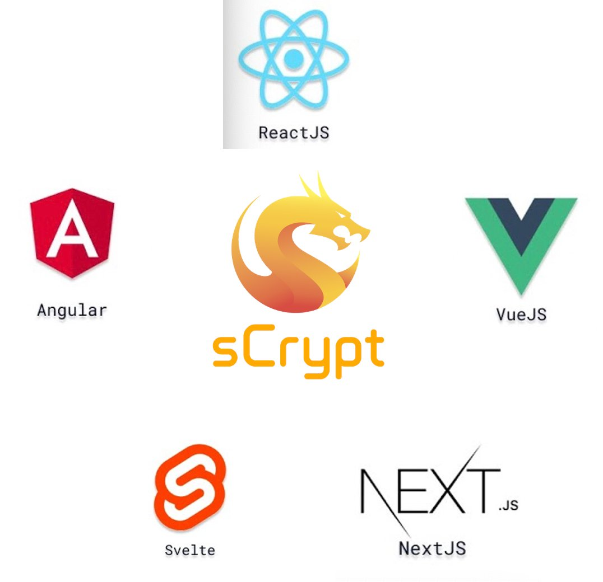
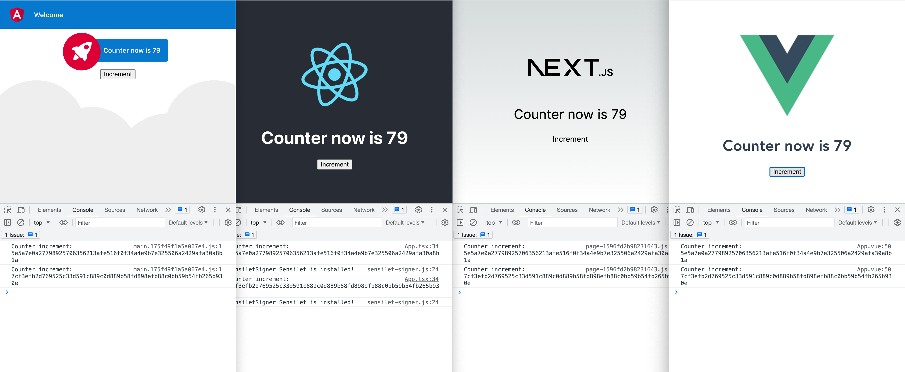

# sCrypt 现已支持各类主流前端框架

sCrypt 现已支持各类主流前端框架，包括：

- React
- Next.js
- Angular
- Svelte
- Vue 3.x or 2.x bundled with Vite or Webpack

通过在这些支持的前端框架中集成sCrypt开发环境，你可以直接在前端项目里访问合约实例和调用合约，方便用户使用[Sensilet](https://sensilet.com/)插件钱包与你的dApp交互。请参考[文档](https://docs.scrypt.io/how-to-integrate-a-frontend/)，了解更多为智能合约集成前端框架的内容。

另外，我们以[计数器](https://github.com/sCrypt-Inc/counter-demos#contract)合约为例，将它集成到了不同的前端框架中。你可以访问我们部署的[线上示例](https://github.com/sCrypt-Inc/counter-demos#deployments)， 使用[Sensilet](https://sensilet.com/)钱包直接与计数器合约交互，或参考我们整理的[代码库](https://github.com/sCrypt-Inc/counter-demos)，了解更多技术细节。

