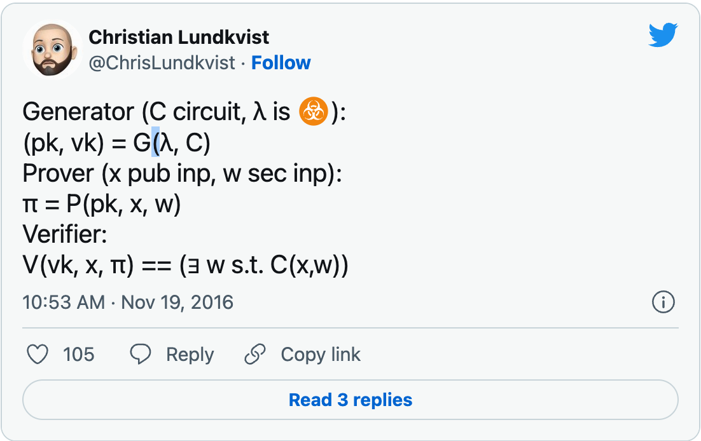
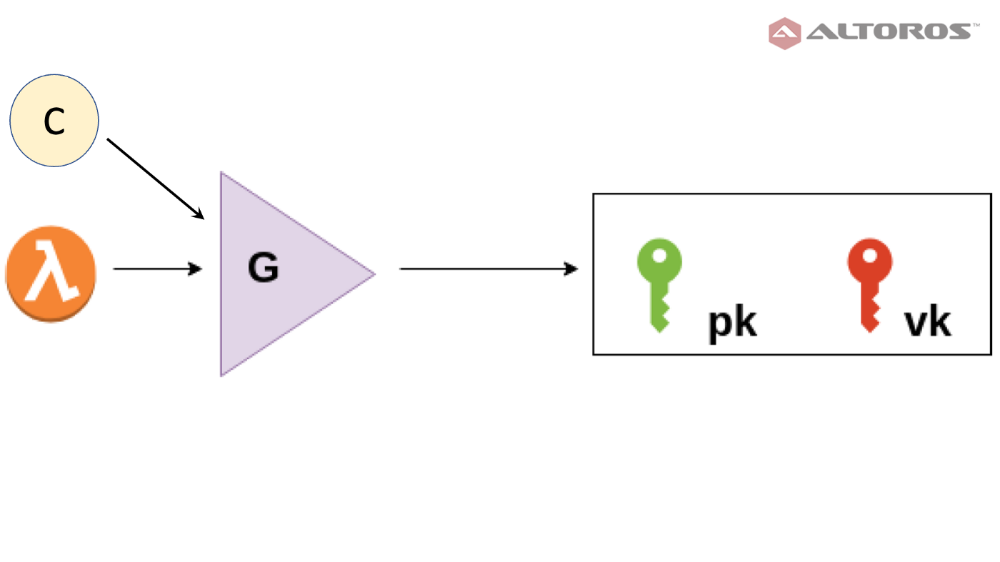
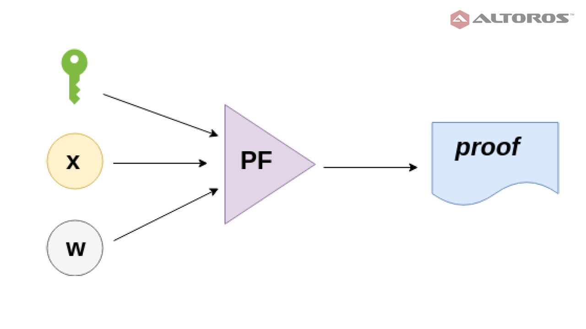
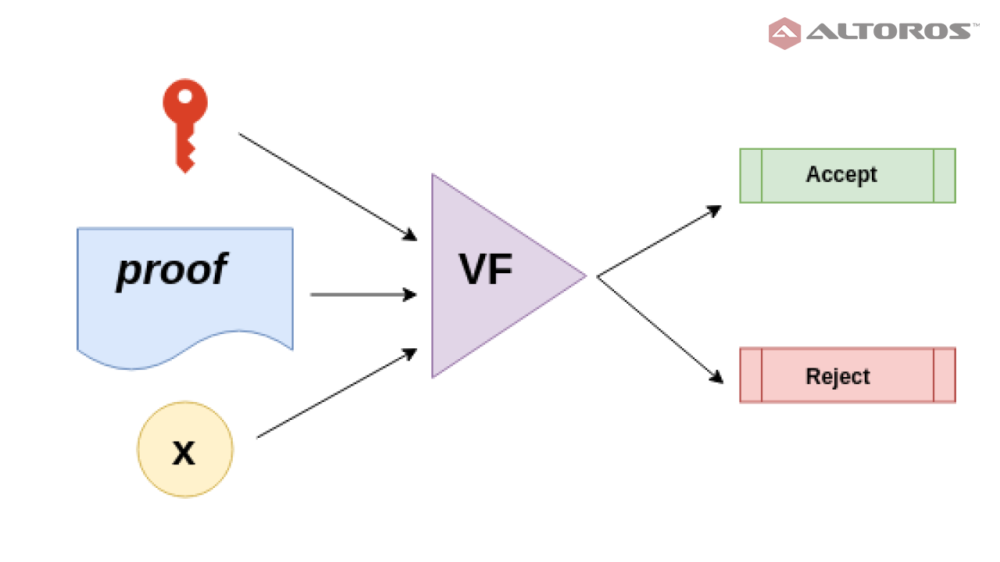
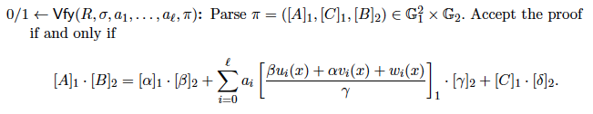

# 比特币上的 zk-SNARKs

> 在比特币上运行 Zcash


在此之前，我们已经使用零知识证明（ZKP）证明了一个人知道一些数学秘密，而无需透露秘密本身。

秘密知识包括：

* 与 [零知识谜题](https://xiaohuiliu.medium.com/zero-knowledge-puzzles-db68f0cc34f0)中的公钥对应的私钥

* [零知识密钥声明证明](https://xiaohuiliu.medium.com/zero-knowledge-key-statement-proof-188ba2dc2c30) 中公共摘要的哈希原像

* [基于零知识证明的托管](https://xiaohuiliu.medium.com/zero-knowledge-proof-and-its-applications-in-bitcoin-aca833d7d745)中私钥的密文


虽然在其特定应用中很有用，但这些零知识证明不能应用于任意数学函数。zk-SNARK（零知识简洁非交互式知识论证）是一种旨在为任何数学函数生成零知识证明的协议，克服了这些限制。生成的证明是“简洁的”和“非交互的”：一个证明只有几百字节，可以在恒定时间内，甚至在几毫秒内得到验证，无需向证明者提出额外的问题。这些特性共同使 zk-SNARK 特别适用于区块链，即使其中链上存储和计算可能很昂贵，并且发送者在发送交易后经常会离线。匿名加密货币 [Zcash](https://z.cash/technology/zksnarks.html) 和智能合约平台 [Ethereum](https://github.com/ethereum/wiki/wiki/Byzantium-Hard-Fork-changes) 是其著名的早期采用者之一。

## zk-SNARK

一个 zk-SNARK 由以下三种算法组成：`G`、`P` 和 `V`。



### 密钥生成 (Key Generation)

密钥生成器 `G` 采用秘密参数 `λ` 和函数 `C`，并生成证明密钥 `pk` 和验证密钥 `vk`。两个密钥都是公开的。



<center><a href="https://www.altoros.com/blog/securing-a-blockchain-with-a-noninteractive-zero-knowledge-proof/">Key Generator</a></center>

`C` 是一个布尔函数（也称为程序或电路），它接受两个输入：
公共输入 `x` 和私有输入 `w`（又名见证人或知识）。例如，`C` 可以是一个检查 `w` 是否是摘要 `x` 的 sha256 原像的函数。

> C(x, w) = sha256(w) == x

### 证明者

证明者 `P` 将证明密钥 `pk`、公共输入 `x` 和秘密的见证人 `w` 作为输入，以生成证明者知道见证人 `w` 的证明，该见证人 `w` 使 `C(x, w)` 返回真。



### 验证者

验证者 `V` 获取验证密钥 `vk`、证明和公共输入 `x`，并且仅当证明是在见证人 w¹ 的知识下生成时才接受。



<center><a href="https://www.altoros.com/blog/securing-a-blockchain-with-a-noninteractive-zero-knowledge-proof/">Verifier</a></center>

## 实现

在区块链中使用 zk-SNARK 时，密钥和证明的生成都是在链下执行的。只有通用验证算法在链上智能合约中运行。文献中有多种 zk-SNARK 方案。我们实现了使用最广泛的方案 [Groth16](https://eprint.iacr.org/2016/260.pdf)，因为它的[证明尺寸小且验证速度快](http://www.zeroknowledgeblog.com/index.php/groth16)。




<center><a href="https://eprint.iacr.org/2016/260.pdf">Groth16</a> 中的验证器：第 18 页</center>


下面列出了基于我们的[椭圆曲线算术](https://xiaohuiliu.medium.com/elliptic-curve-arithmetic-in-script-cb0ab37e4f63)和[配对库](https://blog.csdn.net/freedomhero/article/details/124943936)的完整代码。

```js
import "pairing.scrypt";

// point in G1
struct G1Point {
    int X;
    int Y;
}

// point in G2: encoding of field elements is X[0] * z + X[1]
struct G2Point {
    int[2] X;
    int[2] Y;
}

struct VerifyingKey {
    G1Point alpha;
    G2Point beta;
    G2Point gamma;
    G2Point delta;
    G1Point[N_1] gamma_abc;
}

struct Proof {
    G1Point a;
    G2Point b;
    G1Point c;
}

// zk-snark verification
library ZKSNARK {
    // number of inputs
    static const int N = 2;
    static const int N_1 = 3;

    static function verify(int[N] inputs, Proof proof, VerifyingKey vk) {
        G1Point vk_x = vk.gamma_abc[0];
        loop (N) : i {
            G1Point p = EC.multByScalar(vk.gamma_abc[i + 1], inputs[i]);
            vk_x = EC.addPoints(vk_x, p);
        }

        // pairing check
        require(Pairing.pairing(proof.a, proof.b) == Pairing.pairing(vk.alpha, vk.beta) * 
                Pairing.pairing(vk_x, vk.gamma) * Pairing.pairing(proof.c, vk.delta));
    }
}
```

<center>ZKSNARK 合约源代码</center>

值得注意的是，无论被证明的函数 `C` 有多复杂，证明大小（第 `23`-`27` 行）和配对数（第 `43`-`44` 行）都是恒定的。

##  总结

zk-SNARK 是区块链隐私和可扩展性的强大基础。今天我们只展示了 zk-SNARK 是什么以及如何在比特币上实现它。我们将在不久的将来探索如何使用它。它为什么以及如何在内部工作，这是相当繁重的数学问题，超出了本文的范围。有很多优秀的教程，比如[这个系列](http://coders-errand.com/zk-snarks-and-their-algebraic-structure/)和[这篇论文](https://arxiv.org/abs/1906.07221)。

------------------

[1] 有一个例外。任何人都知道生成器中使用的秘密参数 `λ` 可以在不知道见证人的情况下生成虚假但有效的证明。这就是为什么它被称为有毒废物。在完成受信任的设置阶段之后必须将其丢弃。